# EDA

## Import libraries


```python
import sqlite3
import pandas as pd
import numpy as np
import matplotlib.pyplot as plt
import matplotlib.ticker as mticker
import seaborn as sns
from datetime import datetime
import warnings
warnings.filterwarnings('ignore')

%matplotlib inline
pd.set_option('display.max_columns', None)
sns.set_style("whitegrid")

# Plot style
sns.set_theme(style='whitegrid', palette='muted')
plt.rcParams['figure.figsize'] = (12, 5)
plt.rcParams['axes.titlesize'] = 14
plt.rcParams['axes.labelsize'] = 11

# Database connection
conn = sqlite3.connect(r'..\Data\Database\guest_intelligence.db')

print('Setup complete!')
```

    Setup complete!
    

## Load / Create and Save Raw data 


```python
#Load data
df_guests      = pd.read_sql('SELECT * FROM GUEST_PROFILE',         conn)
df_bookings    = pd.read_sql('SELECT * FROM BOOKING_HISTORY',        conn)
df_stays_beha       = pd.read_sql('SELECT * FROM STAY_BEHAVIOR',          conn)
df_reviews     = pd.read_sql('SELECT * FROM REVIEWS',                conn)
df_act_catalog     = pd.read_sql('SELECT * FROM ACTIVITY_CATALOG',       conn)
df_complaints  = pd.read_sql('SELECT * FROM COMPLAINTS_LOG',         conn)
df_act_preferences = pd.read_sql('SELECT * FROM ACTIVITY_PREFERENCES',   conn)

print(f'GUEST_PROFILE:        {len(df_guests):,} records')
print(f'BOOKING_HISTORY:      {len(df_bookings):,} records')
print(f'STAY_BEHAVIOR:        {len(df_stays_beha):,} records')
print(f'REVIEWS:              {len(df_reviews):,} records')
print(f'ACTIVITY_CATALOG:     {len(df_act_catalog):,} records')
print(f'COMPLAINTS_LOG:       {len(df_complaints):,} records')
print(f'ACTIVITY_PREFERENCES: {len(df_act_preferences):,} records')

#Export data to csv files
df_guests.to_csv(r"..\Data\Datasets-Raw-data\Guests_profile.csv", index=False)
df_bookings.to_csv(r"..\Data\Datasets-Raw-data\Guests_bookings.csv", index=False)
df_stays_beha.to_csv(r"..\Data\Datasets-Raw-data\Guests_stay_behavier.csv", index=False)
df_reviews.to_csv(r"..\Data\Datasets-Raw-data\Guests_reviews.csv", index=False)
df_act_catalog.to_csv(r"..\Data\Datasets-Raw-data\Activities_catalog.csv", index=False)
df_complaints.to_csv(r"..\Data\Datasets-Raw-data\Guests_complaints.csv", index=False)
df_act_preferences.to_csv(r"..\Data\Datasets-Raw-data\Guests_activities_pref.csv", index=False)

print('\nAll files exported successfully!')
```

    GUEST_PROFILE:        3,500 records
    BOOKING_HISTORY:      5,000 records
    STAY_BEHAVIOR:        3,021 records
    REVIEWS:              2,095 records
    ACTIVITY_CATALOG:     81 records
    COMPLAINTS_LOG:       1,698 records
    ACTIVITY_PREFERENCES: 3,021 records
    
    All files exported successfully!
    

## Guest Profile

### Data overview


```python
print("\nData head")
display(df_guests.head(4))
print('\nShape:')
print(df_guests.shape)
print('\nData info:')
print(df_guests.info())
print('\nMissing Values:')
print(df_guests.isnull().sum())
print("\nDuplicate Values:")
print(df_guests.duplicated().sum())
print("\nNumerical columns:")
display(df_guests.select_dtypes(include="number").head(2))
print("\nCategorical columns")
display(df_guests.select_dtypes(exclude="number").head(2))

```

    
    Data head
    


<div>
<style scoped>
    .dataframe tbody tr th:only-of-type {
        vertical-align: middle;
    }

    .dataframe tbody tr th {
        vertical-align: top;
    }

    .dataframe thead th {
        text-align: right;
    }
</style>
<table border="1" class="dataframe">
  <thead>
    <tr style="text-align: right;">
      <th></th>
      <th>guest_id</th>
      <th>title</th>
      <th>first_name</th>
      <th>last_name</th>
      <th>nickname</th>
      <th>date_of_birth</th>
      <th>anniversary_date</th>
      <th>gender</th>
      <th>email</th>
      <th>phone</th>
      <th>country_of_residence</th>
      <th>nationality</th>
      <th>document_type</th>
      <th>document_number</th>
      <th>person_type</th>
      <th>vip_status</th>
      <th>loyalty_trips</th>
      <th>preferred_language</th>
      <th>preferred_cabin_type</th>
      <th>preferred_cabin_view</th>
      <th>allergies</th>
      <th>intolerances</th>
      <th>dietary_restrictions</th>
      <th>mobility_impaired</th>
      <th>mobility_type</th>
      <th>first_trip</th>
      <th>registration_date</th>
      <th>profile_last_updated</th>
      <th>gdpr_consent</th>
      <th>gdpr_consent_date</th>
      <th>emergency_contact</th>
    </tr>
  </thead>
  <tbody>
    <tr>
      <th>0</th>
      <td>G00001</td>
      <td>Ms</td>
      <td>Lesley</td>
      <td>Wells</td>
      <td>Kayleigh</td>
      <td>1997-09-09</td>
      <td>2002-06-25</td>
      <td>Female</td>
      <td>lesley.wells50@icloud.com</td>
      <td>+46 1942167511</td>
      <td>Sweden</td>
      <td>France</td>
      <td>Passport</td>
      <td>BR785783</td>
      <td>Celebrity</td>
      <td>1</td>
      <td>26</td>
      <td>French</td>
      <td>Single</td>
      <td>Mountain View</td>
      <td>No allergy</td>
      <td>Sulfite sensitivity</td>
      <td>Diabetic</td>
      <td>0</td>
      <td>No Mobility Aid</td>
      <td>0</td>
      <td>2023-08-24</td>
      <td>2026-03-09</td>
      <td>0</td>
      <td>Consent Not Given</td>
      <td>Ross Brown - +46 5634948779</td>
    </tr>
    <tr>
      <th>1</th>
      <td>G00002</td>
      <td>Dr</td>
      <td>Alison</td>
      <td>Smith</td>
      <td>Not Provided</td>
      <td>1996-06-29</td>
      <td>No Anniversary</td>
      <td>Female</td>
      <td>alison.smith3@icloud.com</td>
      <td>+52 7916816138</td>
      <td>Mexico</td>
      <td>Italy</td>
      <td>Passport</td>
      <td>WZ989509</td>
      <td>Political</td>
      <td>1</td>
      <td>47</td>
      <td>Italian</td>
      <td>Balcony</td>
      <td>Hotel View</td>
      <td>No allergy</td>
      <td>Histamine</td>
      <td>Vegetarian</td>
      <td>0</td>
      <td>No Mobility Aid</td>
      <td>0</td>
      <td>2025-12-26</td>
      <td>2026-03-09</td>
      <td>1</td>
      <td>2026-01-31</td>
      <td>Christine Gibson - +52 6402095891</td>
    </tr>
    <tr>
      <th>2</th>
      <td>G00003</td>
      <td>Mr</td>
      <td>Jeremy</td>
      <td>Humphries</td>
      <td>Joshua</td>
      <td>1984-08-06</td>
      <td>No Anniversary</td>
      <td>Male</td>
      <td>jeremy.humphries@yahoo.com</td>
      <td>+81 6351379299</td>
      <td>Japan</td>
      <td>Spain</td>
      <td>National ID</td>
      <td>RH914811</td>
      <td>Civil</td>
      <td>0</td>
      <td>13</td>
      <td>Spanish</td>
      <td>Double Room</td>
      <td>Ocean View</td>
      <td>Dairy Free</td>
      <td>Histamine</td>
      <td>Diabetic</td>
      <td>0</td>
      <td>No Mobility Aid</td>
      <td>0</td>
      <td>2024-07-03</td>
      <td>2026-03-09</td>
      <td>1</td>
      <td>2025-04-19</td>
      <td>Reece Kelly - +81 2354787062</td>
    </tr>
    <tr>
      <th>3</th>
      <td>G00004</td>
      <td>Prof</td>
      <td>Dominic</td>
      <td>Hilton</td>
      <td>Not Provided</td>
      <td>1998-03-31</td>
      <td>2017-04-16</td>
      <td>Male</td>
      <td>dhilton@gmail.com</td>
      <td>+41 1578911998</td>
      <td>Switzerland</td>
      <td>United Kingdom</td>
      <td>Residence Permit</td>
      <td>IO118876</td>
      <td>Civil</td>
      <td>0</td>
      <td>11</td>
      <td>English</td>
      <td>Single</td>
      <td>Mountain View</td>
      <td>Garlic powder</td>
      <td>Sulfite sensitivity</td>
      <td>Halal</td>
      <td>0</td>
      <td>No Mobility Aid</td>
      <td>0</td>
      <td>2023-03-17</td>
      <td>2026-03-09</td>
      <td>1</td>
      <td>2024-03-13</td>
      <td>Katherine Whittaker - +41 2797051497</td>
    </tr>
  </tbody>
</table>
</div>


    
    Shape:
    (3500, 31)
    
    Data info:
    <class 'pandas.DataFrame'>
    RangeIndex: 3500 entries, 0 to 3499
    Data columns (total 31 columns):
     #   Column                Non-Null Count  Dtype
    ---  ------                --------------  -----
     0   guest_id              3500 non-null   str  
     1   title                 3500 non-null   str  
     2   first_name            3500 non-null   str  
     3   last_name             3500 non-null   str  
     4   nickname              3500 non-null   str  
     5   date_of_birth         3500 non-null   str  
     6   anniversary_date      3500 non-null   str  
     7   gender                3500 non-null   str  
     8   email                 3500 non-null   str  
     9   phone                 3500 non-null   str  
     10  country_of_residence  3500 non-null   str  
     11  nationality           3500 non-null   str  
     12  document_type         3500 non-null   str  
     13  document_number       3500 non-null   str  
     14  person_type           3500 non-null   str  
     15  vip_status            3500 non-null   int64
     16  loyalty_trips         3500 non-null   int64
     17  preferred_language    3500 non-null   str  
     18  preferred_cabin_type  3500 non-null   str  
     19  preferred_cabin_view  3500 non-null   str  
     20  allergies             3500 non-null   str  
     21  intolerances          3500 non-null   str  
     22  dietary_restrictions  3500 non-null   str  
     23  mobility_impaired     3500 non-null   int64
     24  mobility_type         3500 non-null   str  
     25  first_trip            3500 non-null   int64
     26  registration_date     3500 non-null   str  
     27  profile_last_updated  3500 non-null   str  
     28  gdpr_consent          3500 non-null   int64
     29  gdpr_consent_date     3500 non-null   str  
     30  emergency_contact     3500 non-null   str  
    dtypes: int64(5), str(26)
    memory usage: 847.8 KB
    None
    
    Missing Values:
    guest_id                0
    title                   0
    first_name              0
    last_name               0
    nickname                0
    date_of_birth           0
    anniversary_date        0
    gender                  0
    email                   0
    phone                   0
    country_of_residence    0
    nationality             0
    document_type           0
    document_number         0
    person_type             0
    vip_status              0
    loyalty_trips           0
    preferred_language      0
    preferred_cabin_type    0
    preferred_cabin_view    0
    allergies               0
    intolerances            0
    dietary_restrictions    0
    mobility_impaired       0
    mobility_type           0
    first_trip              0
    registration_date       0
    profile_last_updated    0
    gdpr_consent            0
    gdpr_consent_date       0
    emergency_contact       0
    dtype: int64
    
    Duplicate Values:
    0
    
    Numerical columns:
    


<div>
<style scoped>
    .dataframe tbody tr th:only-of-type {
        vertical-align: middle;
    }

    .dataframe tbody tr th {
        vertical-align: top;
    }

    .dataframe thead th {
        text-align: right;
    }
</style>
<table border="1" class="dataframe">
  <thead>
    <tr style="text-align: right;">
      <th></th>
      <th>vip_status</th>
      <th>loyalty_trips</th>
      <th>mobility_impaired</th>
      <th>first_trip</th>
      <th>gdpr_consent</th>
    </tr>
  </thead>
  <tbody>
    <tr>
      <th>0</th>
      <td>1</td>
      <td>26</td>
      <td>0</td>
      <td>0</td>
      <td>0</td>
    </tr>
    <tr>
      <th>1</th>
      <td>1</td>
      <td>47</td>
      <td>0</td>
      <td>0</td>
      <td>1</td>
    </tr>
  </tbody>
</table>
</div>


    
    Categorical columns
    


<div>
<style scoped>
    .dataframe tbody tr th:only-of-type {
        vertical-align: middle;
    }

    .dataframe tbody tr th {
        vertical-align: top;
    }

    .dataframe thead th {
        text-align: right;
    }
</style>
<table border="1" class="dataframe">
  <thead>
    <tr style="text-align: right;">
      <th></th>
      <th>guest_id</th>
      <th>title</th>
      <th>first_name</th>
      <th>last_name</th>
      <th>nickname</th>
      <th>date_of_birth</th>
      <th>anniversary_date</th>
      <th>gender</th>
      <th>email</th>
      <th>phone</th>
      <th>country_of_residence</th>
      <th>nationality</th>
      <th>document_type</th>
      <th>document_number</th>
      <th>person_type</th>
      <th>preferred_language</th>
      <th>preferred_cabin_type</th>
      <th>preferred_cabin_view</th>
      <th>allergies</th>
      <th>intolerances</th>
      <th>dietary_restrictions</th>
      <th>mobility_type</th>
      <th>registration_date</th>
      <th>profile_last_updated</th>
      <th>gdpr_consent_date</th>
      <th>emergency_contact</th>
    </tr>
  </thead>
  <tbody>
    <tr>
      <th>0</th>
      <td>G00001</td>
      <td>Ms</td>
      <td>Lesley</td>
      <td>Wells</td>
      <td>Kayleigh</td>
      <td>1997-09-09</td>
      <td>2002-06-25</td>
      <td>Female</td>
      <td>lesley.wells50@icloud.com</td>
      <td>+46 1942167511</td>
      <td>Sweden</td>
      <td>France</td>
      <td>Passport</td>
      <td>BR785783</td>
      <td>Celebrity</td>
      <td>French</td>
      <td>Single</td>
      <td>Mountain View</td>
      <td>No allergy</td>
      <td>Sulfite sensitivity</td>
      <td>Diabetic</td>
      <td>No Mobility Aid</td>
      <td>2023-08-24</td>
      <td>2026-03-09</td>
      <td>Consent Not Given</td>
      <td>Ross Brown - +46 5634948779</td>
    </tr>
    <tr>
      <th>1</th>
      <td>G00002</td>
      <td>Dr</td>
      <td>Alison</td>
      <td>Smith</td>
      <td>Not Provided</td>
      <td>1996-06-29</td>
      <td>No Anniversary</td>
      <td>Female</td>
      <td>alison.smith3@icloud.com</td>
      <td>+52 7916816138</td>
      <td>Mexico</td>
      <td>Italy</td>
      <td>Passport</td>
      <td>WZ989509</td>
      <td>Political</td>
      <td>Italian</td>
      <td>Balcony</td>
      <td>Hotel View</td>
      <td>No allergy</td>
      <td>Histamine</td>
      <td>Vegetarian</td>
      <td>No Mobility Aid</td>
      <td>2025-12-26</td>
      <td>2026-03-09</td>
      <td>2026-01-31</td>
      <td>Christine Gibson - +52 6402095891</td>
    </tr>
  </tbody>
</table>
</div>


### Age distribution:


```python

df_guests['age'] = pd.to_datetime(df_guests['date_of_birth']).apply(
    lambda x: (datetime.now() - x).days // 365
)

fig, axes = plt.subplots(1, 2, figsize=(14, 5))

axes[0].hist(df_guests['age'], bins=30, color='steelblue', edgecolor='white')
axes[0].set_title('Age Distribution')
axes[0].set_xlabel('Age')
axes[0].set_ylabel('Count')

age_groups = pd.cut(df_guests['age'],
    bins=[0, 17, 25, 35, 50, 65, 120],
    labels=['Minor', '18-25', '26-35', '36-50', '51-65', '65+']
).value_counts().sort_index()
age_groups.plot(kind='bar', ax=axes[1], color='steelblue', edgecolor='white')
axes[1].set_title('Age Groups')
axes[1].set_xlabel('Age Group')
axes[1].set_ylabel('Count')
axes[1].tick_params(axis='x', rotation=0)

plt.tight_layout()
plt.savefig("..\Images\EDA\Guest_profile\Age_distribution.png")
plt.show()
print(age_groups)
```


    
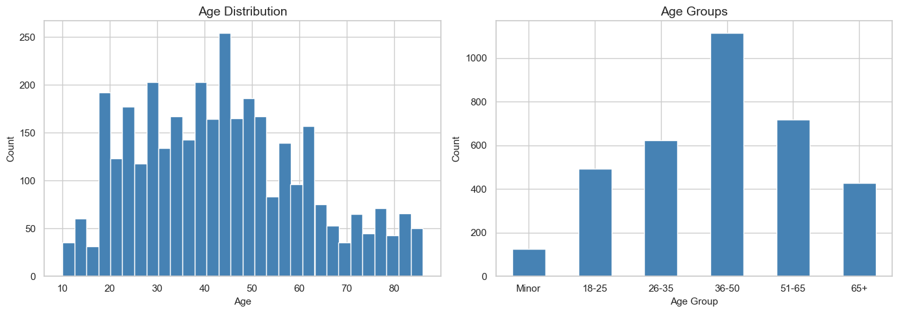
    


    age
    Minor     126
    18-25     492
    26-35     622
    36-50    1115
    51-65     717
    65+       428
    Name: count, dtype: int64
    

### Gender, Person Type, VIP


```python

fig, axes = plt.subplots(1, 3, figsize=(16, 5))

df_guests['gender'].value_counts().plot(kind='bar', ax=axes[0], color='steelblue', edgecolor='white')
axes[0].set_title('Gender Distribution')
axes[0].tick_params(axis='x', rotation=0)

df_guests['person_type'].value_counts().plot(kind='bar', ax=axes[1], color='coral', edgecolor='white')
axes[1].set_title('Person Type Distribution')
axes[1].tick_params(axis='x', rotation=30)

df_guests['vip_status'].value_counts().plot(kind='bar', ax=axes[2], color='gold', edgecolor='white')
axes[2].set_title('VIP Status')
axes[2].set_xticklabels(['Non-VIP', 'VIP'], rotation=0)

plt.tight_layout()
plt.savefig("..\Images\EDA\Guest_profile\Gender_Person_Type_VIP.png")
plt.show()
```


    
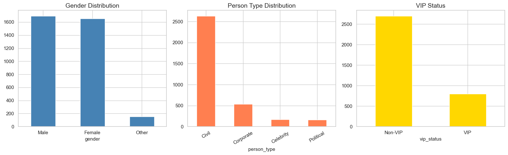
    


### Nationality and Country of Residence


```python

fig, axes = plt.subplots(1, 2, figsize=(16, 5))

df_guests['nationality'].value_counts().head(10).plot(
    kind='barh', ax=axes[0], color='steelblue', edgecolor='white'
)
axes[0].set_title('Top 10 Nationalities')

df_guests['country_of_residence'].value_counts().head(10).plot(
    kind='barh', ax=axes[1], color='coral', edgecolor='white'
)
axes[1].set_title('Top 10 Countries of Residence')

plt.tight_layout()
plt.savefig("..\Images\EDA\Guest_profile\Top_10.png")
plt.show()
```


    
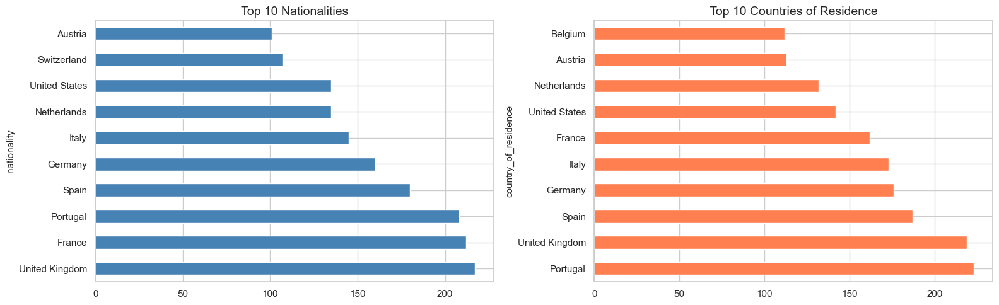
    


### Mobility and Accessibility


```python

fig, axes = plt.subplots(1, 2, figsize=(14, 5))

mobility = df_guests['mobility_impaired'].value_counts()
axes[0].pie(mobility, labels=['Not Impaired', 'Impaired'],
            autopct='%1.1f%%', colors=['steelblue', 'coral'])
axes[0].set_title('Mobility Impairment')

df_guests[df_guests['mobility_impaired'] == 1]['mobility_type'].value_counts().plot(
    kind='bar', ax=axes[1], color='coral', edgecolor='white'
)
axes[1].set_title('Mobility Type (Impaired Guests Only)')
axes[1].tick_params(axis='x', rotation=30)

plt.tight_layout()
plt.savefig("..\Images\EDA\Guest_profile\Mobility_type.png")
plt.show()
```


    
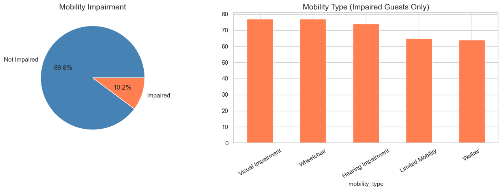
    


### Loyalty Trips Distribution


```python

fig, axes = plt.subplots(1, 2, figsize=(14, 5))

axes[0].hist(df_guests['loyalty_trips'], bins=30, color='steelblue', edgecolor='white')
axes[0].set_title('Loyalty Trips Distribution')
axes[0].set_xlabel('Number of Trips')

print('Loyalty Trips Stats:')
display(df_guests['loyalty_trips'].describe().to_frame().T)

# First trip guests
first_trip = df_guests['first_trip'].value_counts()
axes[1].pie(first_trip, labels=['Returning', 'First Trip'],
            autopct='%1.1f%%', colors=['steelblue', 'coral'])
axes[1].set_title('First Trip vs Returning Guests')

plt.tight_layout()
plt.savefig("..\Images\EDA\Guest_profile\Loyalty_distribution.png")
plt.show()
```

    Loyalty Trips Stats:
    


<div>
<style scoped>
    .dataframe tbody tr th:only-of-type {
        vertical-align: middle;
    }

    .dataframe tbody tr th {
        vertical-align: top;
    }

    .dataframe thead th {
        text-align: right;
    }
</style>
<table border="1" class="dataframe">
  <thead>
    <tr style="text-align: right;">
      <th></th>
      <th>count</th>
      <th>mean</th>
      <th>std</th>
      <th>min</th>
      <th>25%</th>
      <th>50%</th>
      <th>75%</th>
      <th>max</th>
    </tr>
  </thead>
  <tbody>
    <tr>
      <th>loyalty_trips</th>
      <td>3500.0</td>
      <td>11.432857</td>
      <td>10.746278</td>
      <td>0.0</td>
      <td>4.0</td>
      <td>9.0</td>
      <td>14.0</td>
      <td>50.0</td>
    </tr>
  </tbody>
</table>
</div>


    
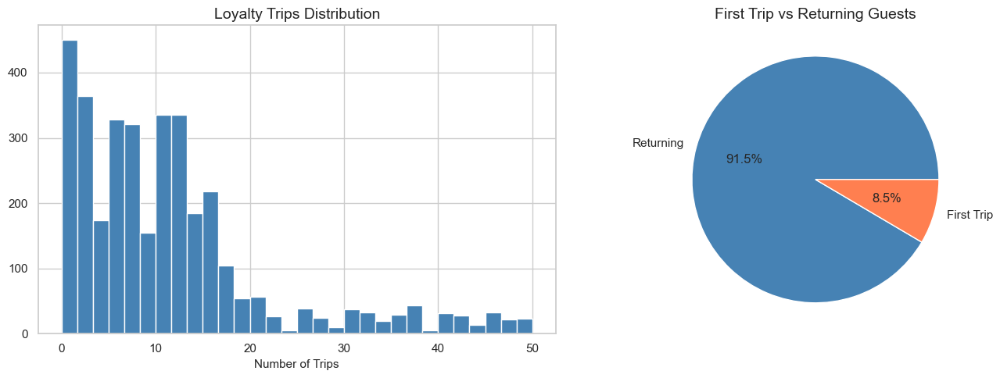
    


`Insights:`
- Shape: (3500, 31)
- Missing values: 0
- Duplicates: 0
- Numerical Variables: 5 (vip_status, loyalty_trips, mobility_impaired, first_trip, gdpr_consent)
- Categorical Variables: 26 (guest_id, title, first_name, last_name	nickname, date_of_birth, anniversary_date, gender, email, phone, country_of_residence, nationality, document_type, document_number, person_type, preferred_language, preferred_cabin_type, preferred_cabin_view, allergies, intolerances, dietary_restrictions, mobility_type, registration_date, profile_last_updated, gdpr_consent_date, emergency_contact)
- Age distribution: the guests median age is 45.
- Age groups: The age group with more frequency is 35-50.
- Gender distribution: Male and Females have closer the same frequency.
- Person type: The Civils are the most frequent guests.
- Vip Status: highest frequency of Non-VIP guests.
- Top 10 Nationalities: Most part of the guests are 
- Top 10 Countries of residence: Most part of the guests have residence in 
- Mobility Impairment: Not impared guests have the highest frequency in hotels.
- Mobility type:  
- Loyalty trip distribution: We have a left skewed distribution, this means that most parte of the guests have trips between 0 and 18, after that we a uniform distribution on the number of trips.
- First-trip vs Returning trip: Most part of the guests are repeaters against to a small percentage of newcomers.

---

## Bookings

### Data Overview


```python
print("\nData head")
display(df_bookings.head(4))
print('\nShape:')
print(df_bookings.shape)
print('\nData info:')
print(df_bookings.info())
print('\nBooking Status:')
print(df_bookings['booking_status'].value_counts())
print('\nMissing Values:')
print(df_bookings.isnull().sum())
print("\nDuplicate Values:")
print(df_bookings.duplicated().sum())
print("\nNumerical columns:")
display(df_bookings.select_dtypes(include="number").head(2))
print("\nCategorical columns")
display(df_bookings.select_dtypes(exclude="number").head(2))
```

    
    Data head
    


<div>
<style scoped>
    .dataframe tbody tr th:only-of-type {
        vertical-align: middle;
    }

    .dataframe tbody tr th {
        vertical-align: top;
    }

    .dataframe thead th {
        text-align: right;
    }
</style>
<table border="1" class="dataframe">
  <thead>
    <tr style="text-align: right;">
      <th></th>
      <th>booking_id</th>
      <th>guest_id</th>
      <th>loyalty_trips_at_booking</th>
      <th>booking_date</th>
      <th>checkin_date</th>
      <th>checkout_date</th>
      <th>checkin_month</th>
      <th>arrival_week_type</th>
      <th>advance_booking_days</th>
      <th>length_of_stay</th>
      <th>adults</th>
      <th>kids</th>
      <th>cabin_type</th>
      <th>cabin_view</th>
      <th>food_package</th>
      <th>drinks_package</th>
      <th>special_requests</th>
      <th>transfer_request</th>
      <th>early_checkin_request</th>
      <th>late_checkout_request</th>
      <th>amenities</th>
      <th>total_booking_value</th>
      <th>payment_method</th>
      <th>payment_country</th>
      <th>booking_channel</th>
      <th>booking_status</th>
      <th>cancellation_type</th>
      <th>num_modifications</th>
      <th>destination</th>
      <th>season</th>
    </tr>
  </thead>
  <tbody>
    <tr>
      <th>0</th>
      <td>B000001</td>
      <td>G01520</td>
      <td>3</td>
      <td>2023-12-27</td>
      <td>2024-01-26</td>
      <td>2024-02-02</td>
      <td>January</td>
      <td>Weekend</td>
      <td>30</td>
      <td>7</td>
      <td>2</td>
      <td>0</td>
      <td>Double Room</td>
      <td>Hotel View</td>
      <td>All Inclusive</td>
      <td>Beer &amp; Wine</td>
      <td>Hypo-Allergenic bed</td>
      <td>0</td>
      <td>0</td>
      <td>0</td>
      <td>Gym access</td>
      <td>2590</td>
      <td>Credit Card</td>
      <td>Saudi Arabia</td>
      <td>Web</td>
      <td>Confirmed</td>
      <td>No Cancellation</td>
      <td>1</td>
      <td>Madeira</td>
      <td>Winter</td>
    </tr>
    <tr>
      <th>1</th>
      <td>B000002</td>
      <td>G00037</td>
      <td>25</td>
      <td>2026-02-14</td>
      <td>2026-02-21</td>
      <td>2026-02-25</td>
      <td>February</td>
      <td>Weekend</td>
      <td>7</td>
      <td>4</td>
      <td>3</td>
      <td>0</td>
      <td>Family Room</td>
      <td>Pool View</td>
      <td>Bed &amp; Breakfast</td>
      <td>None</td>
      <td>High floor</td>
      <td>1</td>
      <td>0</td>
      <td>0</td>
      <td>Airport transfer, Gym access</td>
      <td>960</td>
      <td>Debit Card</td>
      <td>United Kingdom</td>
      <td>Agency</td>
      <td>Completed</td>
      <td>No Cancellation</td>
      <td>0</td>
      <td>Paris</td>
      <td>Winter</td>
    </tr>
    <tr>
      <th>2</th>
      <td>B000003</td>
      <td>G00734</td>
      <td>4</td>
      <td>2023-05-12</td>
      <td>2023-05-26</td>
      <td>2023-06-02</td>
      <td>May</td>
      <td>Weekend</td>
      <td>14</td>
      <td>7</td>
      <td>2</td>
      <td>0</td>
      <td>Double Room</td>
      <td>Ocean View</td>
      <td>Half Board</td>
      <td>Full Package</td>
      <td>Quiet room</td>
      <td>1</td>
      <td>1</td>
      <td>0</td>
      <td>Packages</td>
      <td>2240</td>
      <td>Bank Transfer</td>
      <td>Ireland</td>
      <td>Phone</td>
      <td>Completed</td>
      <td>No Cancellation</td>
      <td>2</td>
      <td>Barcelona</td>
      <td>Spring</td>
    </tr>
    <tr>
      <th>3</th>
      <td>B000004</td>
      <td>G02844</td>
      <td>3</td>
      <td>2025-03-12</td>
      <td>2025-03-26</td>
      <td>2025-03-30</td>
      <td>March</td>
      <td>Weekday</td>
      <td>14</td>
      <td>4</td>
      <td>2</td>
      <td>0</td>
      <td>Double Room</td>
      <td>Hotel View</td>
      <td>Half Board</td>
      <td>Soft Drinks Only</td>
      <td>Separated beds</td>
      <td>0</td>
      <td>0</td>
      <td>0</td>
      <td>Gym access</td>
      <td>920</td>
      <td>Cash</td>
      <td>China</td>
      <td>Agency</td>
      <td>Confirmed</td>
      <td>No Cancellation</td>
      <td>0</td>
      <td>Barcelona</td>
      <td>Spring</td>
    </tr>
  </tbody>
</table>
</div>


    
    Shape:
    (5000, 30)
    
    Data info:
    <class 'pandas.DataFrame'>
    RangeIndex: 5000 entries, 0 to 4999
    Data columns (total 30 columns):
     #   Column                    Non-Null Count  Dtype
    ---  ------                    --------------  -----
     0   booking_id                5000 non-null   str  
     1   guest_id                  5000 non-null   str  
     2   loyalty_trips_at_booking  5000 non-null   int64
     3   booking_date              5000 non-null   str  
     4   checkin_date              5000 non-null   str  
     5   checkout_date             5000 non-null   str  
     6   checkin_month             5000 non-null   str  
     7   arrival_week_type         5000 non-null   str  
     8   advance_booking_days      5000 non-null   int64
     9   length_of_stay            5000 non-null   int64
     10  adults                    5000 non-null   int64
     11  kids                      5000 non-null   int64
     12  cabin_type                5000 non-null   str  
     13  cabin_view                5000 non-null   str  
     14  food_package              5000 non-null   str  
     15  drinks_package            5000 non-null   str  
     16  special_requests          5000 non-null   str  
     17  transfer_request          5000 non-null   int64
     18  early_checkin_request     5000 non-null   int64
     19  late_checkout_request     5000 non-null   int64
     20  amenities                 5000 non-null   str  
     21  total_booking_value       5000 non-null   int64
     22  payment_method            5000 non-null   str  
     23  payment_country           5000 non-null   str  
     24  booking_channel           5000 non-null   str  
     25  booking_status            5000 non-null   str  
     26  cancellation_type         5000 non-null   str  
     27  num_modifications         5000 non-null   int64
     28  destination               5000 non-null   str  
     29  season                    5000 non-null   str  
    dtypes: int64(10), str(20)
    memory usage: 1.1 MB
    None
    
    Booking Status:
    booking_status
    Completed    3021
    Confirmed     948
    Cancelled     773
    No Show       258
    Name: count, dtype: int64
    
    Missing Values:
    booking_id                  0
    guest_id                    0
    loyalty_trips_at_booking    0
    booking_date                0
    checkin_date                0
    checkout_date               0
    checkin_month               0
    arrival_week_type           0
    advance_booking_days        0
    length_of_stay              0
    adults                      0
    kids                        0
    cabin_type                  0
    cabin_view                  0
    food_package                0
    drinks_package              0
    special_requests            0
    transfer_request            0
    early_checkin_request       0
    late_checkout_request       0
    amenities                   0
    total_booking_value         0
    payment_method              0
    payment_country             0
    booking_channel             0
    booking_status              0
    cancellation_type           0
    num_modifications           0
    destination                 0
    season                      0
    dtype: int64
    
    Duplicate Values:
    0
    
    Numerical columns:
    


<div>
<style scoped>
    .dataframe tbody tr th:only-of-type {
        vertical-align: middle;
    }

    .dataframe tbody tr th {
        vertical-align: top;
    }

    .dataframe thead th {
        text-align: right;
    }
</style>
<table border="1" class="dataframe">
  <thead>
    <tr style="text-align: right;">
      <th></th>
      <th>loyalty_trips_at_booking</th>
      <th>advance_booking_days</th>
      <th>length_of_stay</th>
      <th>adults</th>
      <th>kids</th>
      <th>transfer_request</th>
      <th>early_checkin_request</th>
      <th>late_checkout_request</th>
      <th>total_booking_value</th>
      <th>num_modifications</th>
    </tr>
  </thead>
  <tbody>
    <tr>
      <th>0</th>
      <td>3</td>
      <td>30</td>
      <td>7</td>
      <td>2</td>
      <td>0</td>
      <td>0</td>
      <td>0</td>
      <td>0</td>
      <td>2590</td>
      <td>1</td>
    </tr>
    <tr>
      <th>1</th>
      <td>25</td>
      <td>7</td>
      <td>4</td>
      <td>3</td>
      <td>0</td>
      <td>1</td>
      <td>0</td>
      <td>0</td>
      <td>960</td>
      <td>0</td>
    </tr>
  </tbody>
</table>
</div>


    
    Categorical columns
    


<div>
<style scoped>
    .dataframe tbody tr th:only-of-type {
        vertical-align: middle;
    }

    .dataframe tbody tr th {
        vertical-align: top;
    }

    .dataframe thead th {
        text-align: right;
    }
</style>
<table border="1" class="dataframe">
  <thead>
    <tr style="text-align: right;">
      <th></th>
      <th>booking_id</th>
      <th>guest_id</th>
      <th>booking_date</th>
      <th>checkin_date</th>
      <th>checkout_date</th>
      <th>checkin_month</th>
      <th>arrival_week_type</th>
      <th>cabin_type</th>
      <th>cabin_view</th>
      <th>food_package</th>
      <th>drinks_package</th>
      <th>special_requests</th>
      <th>amenities</th>
      <th>payment_method</th>
      <th>payment_country</th>
      <th>booking_channel</th>
      <th>booking_status</th>
      <th>cancellation_type</th>
      <th>destination</th>
      <th>season</th>
    </tr>
  </thead>
  <tbody>
    <tr>
      <th>0</th>
      <td>B000001</td>
      <td>G01520</td>
      <td>2023-12-27</td>
      <td>2024-01-26</td>
      <td>2024-02-02</td>
      <td>January</td>
      <td>Weekend</td>
      <td>Double Room</td>
      <td>Hotel View</td>
      <td>All Inclusive</td>
      <td>Beer &amp; Wine</td>
      <td>Hypo-Allergenic bed</td>
      <td>Gym access</td>
      <td>Credit Card</td>
      <td>Saudi Arabia</td>
      <td>Web</td>
      <td>Confirmed</td>
      <td>No Cancellation</td>
      <td>Madeira</td>
      <td>Winter</td>
    </tr>
    <tr>
      <th>1</th>
      <td>B000002</td>
      <td>G00037</td>
      <td>2026-02-14</td>
      <td>2026-02-21</td>
      <td>2026-02-25</td>
      <td>February</td>
      <td>Weekend</td>
      <td>Family Room</td>
      <td>Pool View</td>
      <td>Bed &amp; Breakfast</td>
      <td>None</td>
      <td>High floor</td>
      <td>Airport transfer, Gym access</td>
      <td>Debit Card</td>
      <td>United Kingdom</td>
      <td>Agency</td>
      <td>Completed</td>
      <td>No Cancellation</td>
      <td>Paris</td>
      <td>Winter</td>
    </tr>
  </tbody>
</table>
</div>


### Booking Status and Channel


```python

fig, axes = plt.subplots(1, 2, figsize=(14, 5))

df_bookings['booking_status'].value_counts().plot(
    kind='bar', ax=axes[0], color='steelblue', edgecolor='white'
)
axes[0].set_title('Booking Status Distribution')
axes[0].tick_params(axis='x', rotation=30)

df_bookings['booking_channel'].value_counts().plot(
    kind='bar', ax=axes[1], color='coral', edgecolor='white'
)
axes[1].set_title('Booking Channel Distribution')
axes[1].tick_params(axis='x', rotation=0)

plt.tight_layout()
plt.savefig("..\Images\EDA\Bookings\Booking_status_channel.png")
plt.show()
```


    
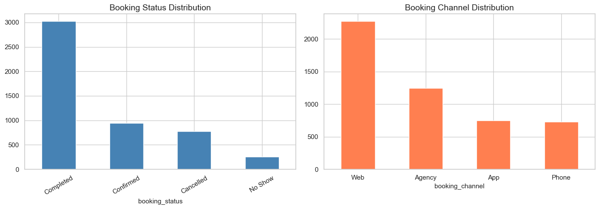
    


### Length of Stay and Advance Booking Days


```python

fig, axes = plt.subplots(1, 2, figsize=(14, 5))

axes[0].hist(df_bookings['length_of_stay'], bins=20, color='steelblue', edgecolor='white')
axes[0].set_title('Length of Stay Distribution')
axes[0].set_xlabel('Nights')

axes[1].hist(df_bookings['advance_booking_days'], bins=30, color='coral', edgecolor='white')
axes[1].set_title('Advance Booking Days')
axes[1].set_xlabel('Days in Advance')

plt.tight_layout()
plt.savefig("..\Images\EDA\Bookings\length_stay_advanced_booking.png")
plt.show()

print('\nLength of Stay Stats:')
display(df_bookings['length_of_stay'].describe().to_frame().T)
print('\nAdvance Booking Days Stats:')
display(df_bookings['advance_booking_days'].describe().to_frame().T)
```


    
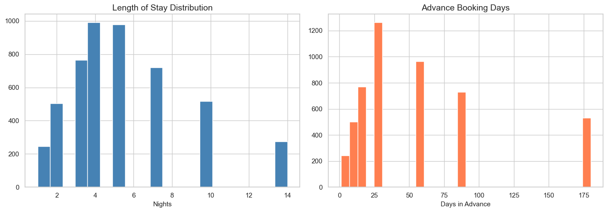
    


    
    Length of Stay Stats:
    


<div>
<style scoped>
    .dataframe tbody tr th:only-of-type {
        vertical-align: middle;
    }

    .dataframe tbody tr th {
        vertical-align: top;
    }

    .dataframe thead th {
        text-align: right;
    }
</style>
<table border="1" class="dataframe">
  <thead>
    <tr style="text-align: right;">
      <th></th>
      <th>count</th>
      <th>mean</th>
      <th>std</th>
      <th>min</th>
      <th>25%</th>
      <th>50%</th>
      <th>75%</th>
      <th>max</th>
    </tr>
  </thead>
  <tbody>
    <tr>
      <th>length_of_stay</th>
      <td>5000.0</td>
      <td>5.2996</td>
      <td>3.171096</td>
      <td>1.0</td>
      <td>3.0</td>
      <td>4.0</td>
      <td>7.0</td>
      <td>14.0</td>
    </tr>
  </tbody>
</table>
</div>


    
    Advance Booking Days Stats:
    


<div>
<style scoped>
    .dataframe tbody tr th:only-of-type {
        vertical-align: middle;
    }

    .dataframe tbody tr th {
        vertical-align: top;
    }

    .dataframe thead th {
        text-align: right;
    }
</style>
<table border="1" class="dataframe">
  <thead>
    <tr style="text-align: right;">
      <th></th>
      <th>count</th>
      <th>mean</th>
      <th>std</th>
      <th>min</th>
      <th>25%</th>
      <th>50%</th>
      <th>75%</th>
      <th>max</th>
    </tr>
  </thead>
  <tbody>
    <tr>
      <th>advance_booking_days</th>
      <td>5000.0</td>
      <td>54.2598</td>
      <td>51.265602</td>
      <td>1.0</td>
      <td>14.0</td>
      <td>30.0</td>
      <td>90.0</td>
      <td>180.0</td>
    </tr>
  </tbody>
</table>
</div>


### Season and Cabin Type


```python

fig, axes = plt.subplots(1, 2, figsize=(14, 5))

season_order = ['Spring', 'Summer', 'Autumn', 'Winter']
df_bookings['season'].value_counts().reindex(season_order).plot(
    kind='bar', ax=axes[0], color='steelblue', edgecolor='white'
)
axes[0].set_title('Bookings by Season')
axes[0].tick_params(axis='x', rotation=0)

df_bookings['cabin_type'].value_counts().plot(
    kind='barh', ax=axes[1], color='coral', edgecolor='white'
)
axes[1].set_title('Cabin Type Distribution')

plt.tight_layout()
plt.savefig("..\Images\EDA\Bookings\Season_cabin_pref.png")
plt.show()
```


    
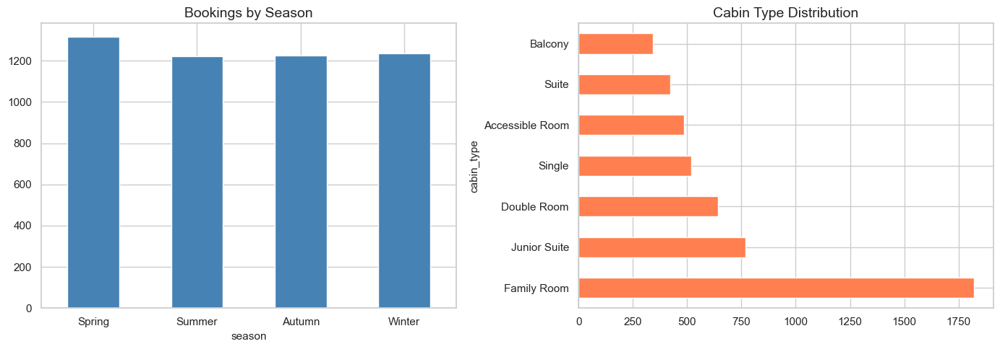
    


### Payment Method and Total Booking Value


```python

fig, axes = plt.subplots(1, 2, figsize=(14, 5))

df_bookings['payment_method'].value_counts().plot(
    kind='bar', ax=axes[0], color='steelblue', edgecolor='white'
)
axes[0].set_title('Payment Method Distribution')
axes[0].tick_params(axis='x', rotation=30)

axes[1].hist(df_bookings['total_booking_value'], bins=30, color='coral', edgecolor='white')
axes[1].set_title('Total Booking Value Distribution (€)')
axes[1].set_xlabel('Value (€)')

plt.tight_layout()
plt.savefig("..\Images\EDA\Bookings\payment_booking_value.png")
plt.show()

print('\nTotal Booking Value Stats:')
print(df_bookings['total_booking_value'].describe())
```


    
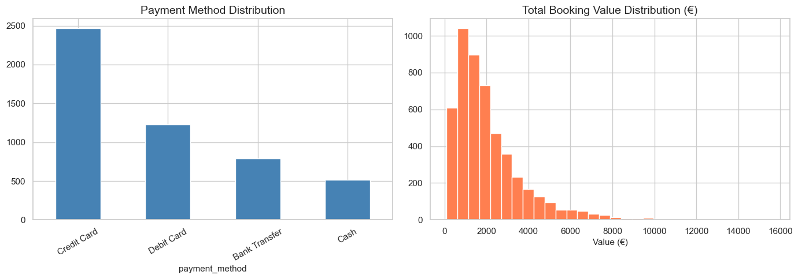
    


    
    Total Booking Value Stats:
    count     5000.000000
    mean      2082.862000
    std       1692.566582
    min        100.000000
    25%        945.000000
    50%       1600.000000
    75%       2700.000000
    max      15680.000000
    Name: total_booking_value, dtype: float64
    

### KYC Signal — Payment Country vs Nationality


```python

df_kyc = df_bookings.merge(df_guests[['guest_id', 'nationality']], on='guest_id')
df_kyc['payment_country_mismatch'] = (df_kyc['payment_country'] != df_kyc['nationality']).astype(int)

mismatch_rate = df_kyc['payment_country_mismatch'].mean() * 100
print(f'Payment Country Mismatch Rate: {mismatch_rate:.1f}%')

fig, ax = plt.subplots(figsize=(8, 5))
df_kyc['payment_country_mismatch'].value_counts().plot(
    kind='bar', ax=ax, color=['steelblue', 'coral'], edgecolor='white'
)
ax.set_title('Payment Country vs Nationality Match (KYC Signal)')
ax.set_xticklabels(['Match', 'Mismatch'], rotation=0)

plt.tight_layout()
plt.savefig("..\Images\EDA\Bookings\KYC_SIGNAL.png")
plt.show()
```

    Payment Country Mismatch Rate: 19.4%
    


    
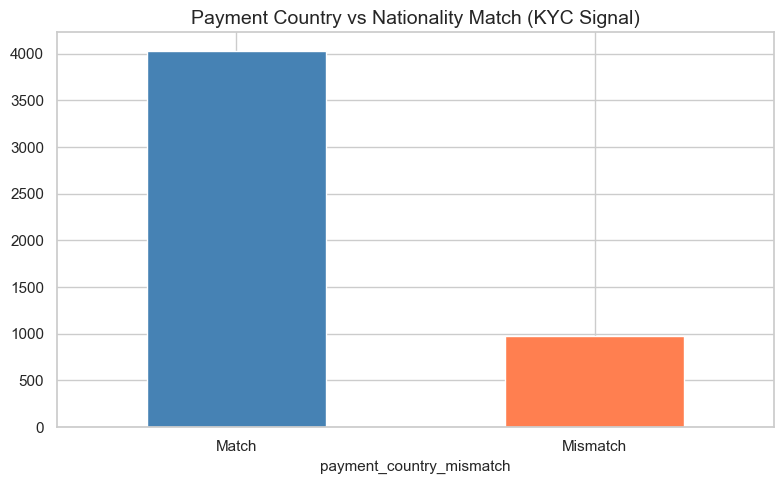
    


`Insights:`
- Shape: (5000, 30)
- Missing values: 0
- Duplicates: 0
- Numerical Variables: 10 (loyalty_trips_at_booking, advance_booking_days, length_of_stay, adults, kids, transfer_request, early_checkin_request, late_checkout_request, total_booking_value, num_modifications)
- Categorical Variables: 20 (booking_id, guest_id, booking_date, checkin_date, checkout_date, checkin_month, arrival_week_type, cabin_type, cabin_view, food_package, drinks_package, special_requests, amenities, payment_method, payment_country, booking_channel, booking_status, cancellation_type, destination, season)
- Booking status distribution: left skewed distribution, high number of completed bookings and a small number of no show guests.
- Booking Channel distribution: left skewed distribution, most part of the guests use the web for reservation proposes and we have a similar number of reserveation on phone and app.
- Lengh of stay: Most part of the guests stays in median 5 nights.
- Advance booking days: The guests avarage reservs the hotels in 50 days prior.
- Bookings by season: The guests are uniformly distributed by seasons.
- Cabin type: We have a right skewed distribution by the room type, the room with high choice is the family room.
- Payment Method: Left skewed distribution, credit-card is the payment with more choice.
- Total Booking Value: Left skewed distribution, the guests spend are high concentrated between 0-4000.
- KYC signal: We have a small amount of mismatch payments country.

---

## Stay Behavior

### Data overview


```python
print("\nData head")
display(df_stays_beha.head(4))
print('\nShape:')
print(df_stays_beha.shape)
print('\nData info:')
print(df_stays_beha.info())
print('\nMissing Values:')
print(df_stays_beha.isnull().sum())
print("\nDuplicate Values:")
print(df_stays_beha.duplicated().sum())
print("\nNumerical columns:")
display(df_stays_beha.select_dtypes(include="number").head(2))
print("\nCategorical columns")
display(df_stays_beha.select_dtypes(exclude="number").head(2))
```

    
    Data head
    


<div>
<style scoped>
    .dataframe tbody tr th:only-of-type {
        vertical-align: middle;
    }

    .dataframe tbody tr th {
        vertical-align: top;
    }

    .dataframe thead th {
        text-align: right;
    }
</style>
<table border="1" class="dataframe">
  <thead>
    <tr style="text-align: right;">
      <th></th>
      <th>stay_id</th>
      <th>booking_id</th>
      <th>guest_id</th>
      <th>actual_checkin_time</th>
      <th>actual_checkout_time</th>
      <th>early_checkin_granted</th>
      <th>late_checkout_granted</th>
      <th>spa_visits</th>
      <th>spa_spend</th>
      <th>restaurant_visits</th>
      <th>restaurant_spend</th>
      <th>bar_visits</th>
      <th>bar_spend</th>
      <th>excursion_visits</th>
      <th>excursion_spend</th>
      <th>reception_visits</th>
      <th>reception_visit_reason</th>
      <th>num_complaints</th>
      <th>complaint_type</th>
      <th>complaint_resolved_on_spot</th>
      <th>incident_registered</th>
      <th>incident_type</th>
      <th>refused_additional_info</th>
      <th>refusal_reason</th>
      <th>overall_satisfaction</th>
    </tr>
  </thead>
  <tbody>
    <tr>
      <th>0</th>
      <td>S000001</td>
      <td>B002310</td>
      <td>G01715</td>
      <td>13:15</td>
      <td>12:30</td>
      <td>0</td>
      <td>0</td>
      <td>1</td>
      <td>44.50</td>
      <td>1</td>
      <td>23.02</td>
      <td>3</td>
      <td>101.49</td>
      <td>1</td>
      <td>257.72</td>
      <td>0</td>
      <td>No Reception Visit</td>
      <td>0</td>
      <td>No complaint</td>
      <td>-1</td>
      <td>0</td>
      <td>No incident</td>
      <td>0</td>
      <td>No Refusal</td>
      <td>6</td>
    </tr>
    <tr>
      <th>1</th>
      <td>S000002</td>
      <td>B001037</td>
      <td>G03129</td>
      <td>16:15</td>
      <td>12:15</td>
      <td>0</td>
      <td>0</td>
      <td>3</td>
      <td>313.76</td>
      <td>3</td>
      <td>34.68</td>
      <td>0</td>
      <td>0.00</td>
      <td>0</td>
      <td>0.00</td>
      <td>1</td>
      <td>Request</td>
      <td>0</td>
      <td>No complaint</td>
      <td>-1</td>
      <td>0</td>
      <td>No incident</td>
      <td>0</td>
      <td>No Refusal</td>
      <td>10</td>
    </tr>
    <tr>
      <th>2</th>
      <td>S000003</td>
      <td>B000542</td>
      <td>G02982</td>
      <td>14:30</td>
      <td>11:45</td>
      <td>0</td>
      <td>0</td>
      <td>2</td>
      <td>86.40</td>
      <td>4</td>
      <td>141.29</td>
      <td>3</td>
      <td>82.38</td>
      <td>0</td>
      <td>0.00</td>
      <td>1</td>
      <td>Request</td>
      <td>2</td>
      <td>Other</td>
      <td>1</td>
      <td>0</td>
      <td>No incident</td>
      <td>0</td>
      <td>No Refusal</td>
      <td>1</td>
    </tr>
    <tr>
      <th>3</th>
      <td>S000004</td>
      <td>B000346</td>
      <td>G02487</td>
      <td>13:00</td>
      <td>12:45</td>
      <td>0</td>
      <td>0</td>
      <td>3</td>
      <td>191.82</td>
      <td>8</td>
      <td>338.43</td>
      <td>0</td>
      <td>0.00</td>
      <td>3</td>
      <td>270.53</td>
      <td>3</td>
      <td>Problem</td>
      <td>1</td>
      <td>Staff Behavior</td>
      <td>0</td>
      <td>0</td>
      <td>No incident</td>
      <td>1</td>
      <td>Other</td>
      <td>4</td>
    </tr>
  </tbody>
</table>
</div>


    
    Shape:
    (3021, 25)
    
    Data info:
    <class 'pandas.DataFrame'>
    RangeIndex: 3021 entries, 0 to 3020
    Data columns (total 25 columns):
     #   Column                      Non-Null Count  Dtype  
    ---  ------                      --------------  -----  
     0   stay_id                     3021 non-null   str    
     1   booking_id                  3021 non-null   str    
     2   guest_id                    3021 non-null   str    
     3   actual_checkin_time         3021 non-null   str    
     4   actual_checkout_time        3021 non-null   str    
     5   early_checkin_granted       3021 non-null   int64  
     6   late_checkout_granted       3021 non-null   int64  
     7   spa_visits                  3021 non-null   int64  
     8   spa_spend                   3021 non-null   float64
     9   restaurant_visits           3021 non-null   int64  
     10  restaurant_spend            3021 non-null   float64
     11  bar_visits                  3021 non-null   int64  
     12  bar_spend                   3021 non-null   float64
     13  excursion_visits            3021 non-null   int64  
     14  excursion_spend             3021 non-null   float64
     15  reception_visits            3021 non-null   int64  
     16  reception_visit_reason      3021 non-null   str    
     17  num_complaints              3021 non-null   int64  
     18  complaint_type              3021 non-null   str    
     19  complaint_resolved_on_spot  3021 non-null   int64  
     20  incident_registered         3021 non-null   int64  
     21  incident_type               3021 non-null   str    
     22  refused_additional_info     3021 non-null   int64  
     23  refusal_reason              3021 non-null   str    
     24  overall_satisfaction        3021 non-null   int64  
    dtypes: float64(4), int64(12), str(9)
    memory usage: 590.2 KB
    None
    
    Missing Values:
    stay_id                       0
    booking_id                    0
    guest_id                      0
    actual_checkin_time           0
    actual_checkout_time          0
    early_checkin_granted         0
    late_checkout_granted         0
    spa_visits                    0
    spa_spend                     0
    restaurant_visits             0
    restaurant_spend              0
    bar_visits                    0
    bar_spend                     0
    excursion_visits              0
    excursion_spend               0
    reception_visits              0
    reception_visit_reason        0
    num_complaints                0
    complaint_type                0
    complaint_resolved_on_spot    0
    incident_registered           0
    incident_type                 0
    refused_additional_info       0
    refusal_reason                0
    overall_satisfaction          0
    dtype: int64
    
    Duplicate Values:
    0
    
    Numerical columns:
    


<div>
<style scoped>
    .dataframe tbody tr th:only-of-type {
        vertical-align: middle;
    }

    .dataframe tbody tr th {
        vertical-align: top;
    }

    .dataframe thead th {
        text-align: right;
    }
</style>
<table border="1" class="dataframe">
  <thead>
    <tr style="text-align: right;">
      <th></th>
      <th>early_checkin_granted</th>
      <th>late_checkout_granted</th>
      <th>spa_visits</th>
      <th>spa_spend</th>
      <th>restaurant_visits</th>
      <th>restaurant_spend</th>
      <th>bar_visits</th>
      <th>bar_spend</th>
      <th>excursion_visits</th>
      <th>excursion_spend</th>
      <th>reception_visits</th>
      <th>num_complaints</th>
      <th>complaint_resolved_on_spot</th>
      <th>incident_registered</th>
      <th>refused_additional_info</th>
      <th>overall_satisfaction</th>
    </tr>
  </thead>
  <tbody>
    <tr>
      <th>0</th>
      <td>0</td>
      <td>0</td>
      <td>1</td>
      <td>44.50</td>
      <td>1</td>
      <td>23.02</td>
      <td>3</td>
      <td>101.49</td>
      <td>1</td>
      <td>257.72</td>
      <td>0</td>
      <td>0</td>
      <td>-1</td>
      <td>0</td>
      <td>0</td>
      <td>6</td>
    </tr>
    <tr>
      <th>1</th>
      <td>0</td>
      <td>0</td>
      <td>3</td>
      <td>313.76</td>
      <td>3</td>
      <td>34.68</td>
      <td>0</td>
      <td>0.00</td>
      <td>0</td>
      <td>0.00</td>
      <td>1</td>
      <td>0</td>
      <td>-1</td>
      <td>0</td>
      <td>0</td>
      <td>10</td>
    </tr>
  </tbody>
</table>
</div>


    
    Categorical columns
    


<div>
<style scoped>
    .dataframe tbody tr th:only-of-type {
        vertical-align: middle;
    }

    .dataframe tbody tr th {
        vertical-align: top;
    }

    .dataframe thead th {
        text-align: right;
    }
</style>
<table border="1" class="dataframe">
  <thead>
    <tr style="text-align: right;">
      <th></th>
      <th>stay_id</th>
      <th>booking_id</th>
      <th>guest_id</th>
      <th>actual_checkin_time</th>
      <th>actual_checkout_time</th>
      <th>reception_visit_reason</th>
      <th>complaint_type</th>
      <th>incident_type</th>
      <th>refusal_reason</th>
    </tr>
  </thead>
  <tbody>
    <tr>
      <th>0</th>
      <td>S000001</td>
      <td>B002310</td>
      <td>G01715</td>
      <td>13:15</td>
      <td>12:30</td>
      <td>No Reception Visit</td>
      <td>No complaint</td>
      <td>No incident</td>
      <td>No Refusal</td>
    </tr>
    <tr>
      <th>1</th>
      <td>S000002</td>
      <td>B001037</td>
      <td>G03129</td>
      <td>16:15</td>
      <td>12:15</td>
      <td>Request</td>
      <td>No complaint</td>
      <td>No incident</td>
      <td>No Refusal</td>
    </tr>
  </tbody>
</table>
</div>


### Consumption Overview


```python

spend_cols = ['spa_spend', 'restaurant_spend', 'bar_spend', 'excursion_spend']
df_stays_beha['total_spend'] = df_stays_beha[spend_cols].sum(axis=1)

fig, axes = plt.subplots(2, 2, figsize=(14, 10))
colors = ['steelblue', 'coral', 'gold', 'mediumseagreen']

for ax, col, color in zip(axes.flatten(), spend_cols, colors):
    ax.hist(df_stays_beha[col], bins=30, color=color, edgecolor='white')
    ax.set_title(f'{col.replace("_", " ").title()} Distribution')
    ax.set_xlabel('Spend (€)')


plt.suptitle('Consumption Spend Distributions', fontsize=14, y=1.02)
plt.tight_layout()
plt.savefig("..\Images\EDA\Stay_beha\overall_cons.png")
plt.show()

print('\nSpend Stats:')
print(df_stays_beha[spend_cols + ['total_spend']].describe())
```


    
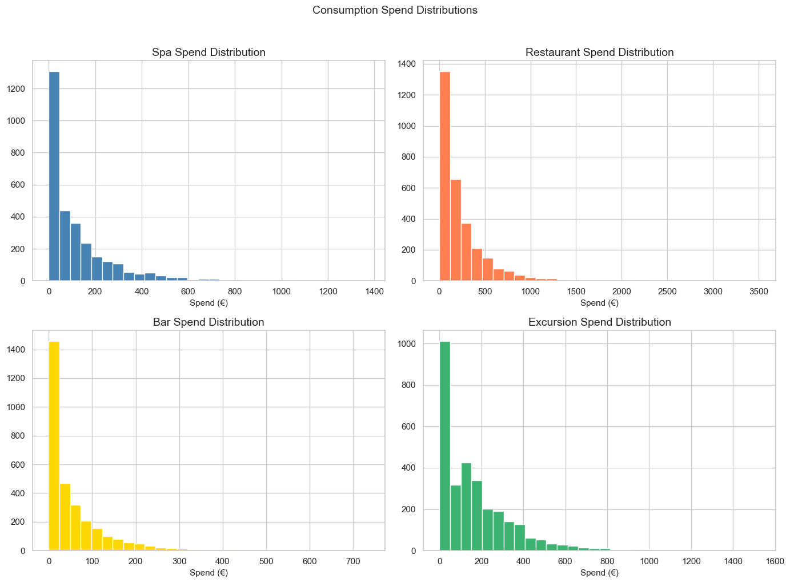
    


    
    Spend Stats:
             spa_spend  restaurant_spend    bar_spend  excursion_spend  \
    count  3021.000000       3021.000000  3021.000000      3021.000000   
    mean    120.230007        245.647190    54.463750       164.793939   
    std     170.119921        309.357325    77.436389       186.134170   
    min       0.000000          3.990000     0.000000         0.000000   
    25%       0.000000         61.660000     0.000000         0.000000   
    50%      67.580000        142.900000    27.240000       124.570000   
    75%     169.070000        309.870000    74.410000       246.090000   
    max    1376.490000       3513.760000   736.140000      1527.760000   
    
           total_spend  
    count  3021.000000  
    mean    585.134886  
    std     448.603445  
    min       8.830000  
    25%     282.990000  
    50%     478.210000  
    75%     754.370000  
    max    4888.000000  
    

`Insights:`
- Shape: (3017, 25)
- Missing values: 0
- Duplicates: 0
- Numerical Variables: 16 (early_checkin_granted, late_checkout_granted, spa_visits, spa_spend, restaurant_visits, restaurant_spend, bar_visits	bar_spend, excursion_visits, excursion_spend, reception_visits, num_complaints, complaint_resolved_on_spot, incident_registered, refused_additional_info, overall_satisfaction)
- Categorical Variables: 20 (stay_id, booking_id, guest_id, actual_checkin_time, actual_checkout_time, reception_visit_reason, complaint_type, incident_type, refusal_reason)
- 

### Complaints and Incidents


```python

fig, axes = plt.subplots(1, 3, figsize=(16, 5))

df_stays_beha['num_complaints'].value_counts().sort_index().plot(
    kind='bar', ax=axes[0], color='coral', edgecolor='white'
)
axes[0].set_title('Number of Complaints per Stay')
axes[0].tick_params(axis='x', rotation=0)

df_stays_beha['complaint_type'].value_counts().head(8).plot(
    kind='barh', ax=axes[1], color='coral', edgecolor='white'
)
axes[1].set_title('Complaint Types')

df_stays_beha['incident_type'].value_counts().plot(
    kind='bar', ax=axes[2], color='crimson', edgecolor='white'
)
axes[2].set_title('Incident Types')
axes[2].tick_params(axis='x', rotation=30)


plt.tight_layout()
plt.savefig("..\Images\EDA\Stay_beha\Complaint_incidents.png")
plt.show()
```


    
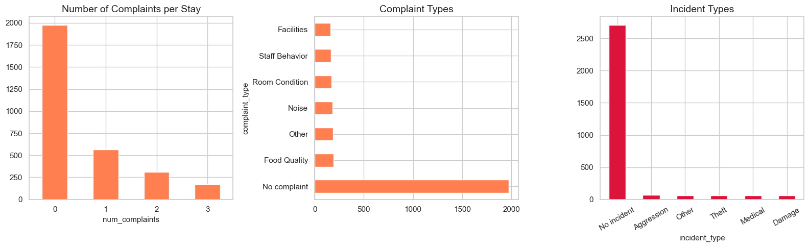
    


### Overall Satisfaction Distribution


```python

fig, axes = plt.subplots(1, 2, figsize=(14, 5))

df_stays_beha['overall_satisfaction'].value_counts().sort_index().plot(
    kind='bar', ax=axes[0], color='steelblue', edgecolor='white'
)
axes[0].set_title('Overall Satisfaction Distribution (1-10)')
axes[0].tick_params(axis='x', rotation=0)

# Satisfaction vs Complaints
df_stays_beha.groupby('num_complaints')['overall_satisfaction'].mean().plot(
    kind='bar', ax=axes[1], color='coral', edgecolor='white'
)
axes[1].set_title('Avg Satisfaction by Number of Complaints')
axes[1].tick_params(axis='x', rotation=0)


plt.tight_layout()
plt.savefig("..\Images\EDA\Stay_beha\overall_satisfaction.png")
plt.show()
```


    
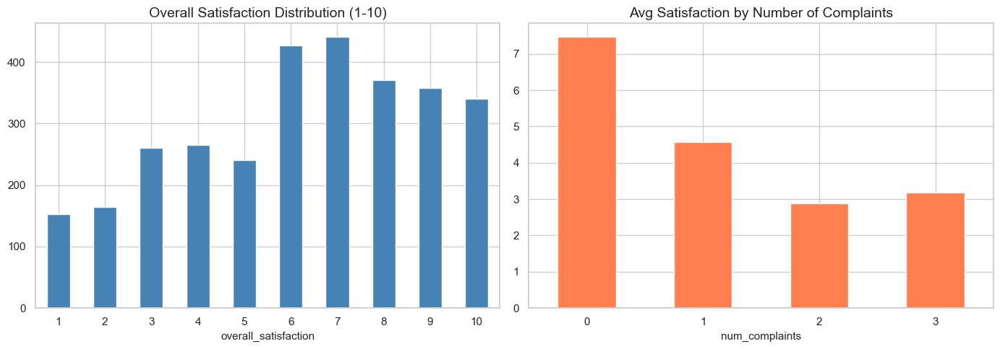
    


### KYC Signal — Information Refusal


```python

refusal_rate = df_stays_beha['refused_additional_info'].mean() * 100
print(f'Information Refusal Rate: {refusal_rate:.1f}%')

fig, axes = plt.subplots(1, 2, figsize=(14, 5))

df_stays_beha['refused_additional_info'].value_counts().plot(
    kind='bar', ax=axes[0], color=['steelblue', 'coral'], edgecolor='white'
)
axes[0].set_title('Information Refusal (KYC Signal)')
axes[0].set_xticklabels(['Not Refused', 'Refused'], rotation=0)

df_stays_beha[df_stays_beha['refused_additional_info'] == 1]['refusal_reason'].value_counts().plot(
    kind='barh', ax=axes[1], color='coral', edgecolor='white'
)
axes[1].set_title('Refusal Reasons')


plt.tight_layout()
plt.savefig("..\Images\EDA\Stay_beha\KYC_signal.png")
plt.show()
```

    Information Refusal Rate: 14.6%
    


    
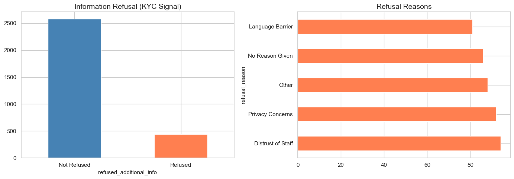
    


------

## Reviews

### Data overview


```python
print("\nData head")
display(df_reviews.head(4))
print('\nShape:')
print(df_reviews.shape)
print('\nData info:')
print(df_reviews.info())
print('\nMissing Values:')
print(df_reviews.isnull().sum())
print("\nDuplicate Values:")
print(df_reviews.duplicated().sum())
review_rate = len(df_reviews) / len(df_stays_beha) * 100
print(f'Review Response Rate: {review_rate:.1f}%')
print("\nNumerical columns:")
display(df_reviews.select_dtypes(include="number").head(2))
print("\nCategorical columns")
display(df_reviews.select_dtypes(exclude="number").head(2))
```

    
    Data head
    


<div>
<style scoped>
    .dataframe tbody tr th:only-of-type {
        vertical-align: middle;
    }

    .dataframe tbody tr th {
        vertical-align: top;
    }

    .dataframe thead th {
        text-align: right;
    }
</style>
<table border="1" class="dataframe">
  <thead>
    <tr style="text-align: right;">
      <th></th>
      <th>review_id</th>
      <th>booking_id</th>
      <th>guest_id</th>
      <th>stay_id</th>
      <th>review_date</th>
      <th>review_channel</th>
      <th>room_cleanliness</th>
      <th>room_comfort</th>
      <th>room_size</th>
      <th>noise_level</th>
      <th>air_conditioning</th>
      <th>view</th>
      <th>food_quality</th>
      <th>food_variety</th>
      <th>restaurant_service</th>
      <th>bar_service</th>
      <th>staff_friendliness</th>
      <th>staff_professionalism</th>
      <th>receptionist_service</th>
      <th>concierge_service</th>
      <th>spa_wellness_availability</th>
      <th>gym_availability</th>
      <th>common_areas_quality</th>
      <th>quiet_relaxation_areas</th>
      <th>conference_work_facilities</th>
      <th>privacy_work_spaces</th>
      <th>pool_availability</th>
      <th>cleanliness_common_areas</th>
      <th>activities_quality</th>
      <th>activities_variety</th>
      <th>excursions_quality</th>
      <th>value_for_money</th>
      <th>overall_experience</th>
      <th>would_recommend</th>
      <th>review_text</th>
      <th>had_complaints</th>
      <th>complaints_resolved</th>
    </tr>
  </thead>
  <tbody>
    <tr>
      <th>0</th>
      <td>R000002</td>
      <td>B001037</td>
      <td>G03129</td>
      <td>S000002</td>
      <td>2023-09-23</td>
      <td>Email</td>
      <td>5</td>
      <td>5</td>
      <td>4</td>
      <td>4</td>
      <td>5</td>
      <td>5</td>
      <td>5</td>
      <td>5</td>
      <td>5</td>
      <td>5</td>
      <td>5</td>
      <td>4</td>
      <td>5</td>
      <td>5</td>
      <td>5</td>
      <td>5</td>
      <td>5</td>
      <td>4</td>
      <td>4</td>
      <td>4</td>
      <td>5</td>
      <td>5</td>
      <td>5</td>
      <td>4</td>
      <td>5</td>
      <td>5</td>
      <td>5</td>
      <td>1</td>
      <td>Absolutely wonderful experience! The staff wer...</td>
      <td>0</td>
      <td>-1</td>
    </tr>
    <tr>
      <th>1</th>
      <td>R000003</td>
      <td>B000542</td>
      <td>G02982</td>
      <td>S000003</td>
      <td>2024-09-27</td>
      <td>Google</td>
      <td>2</td>
      <td>2</td>
      <td>3</td>
      <td>2</td>
      <td>2</td>
      <td>2</td>
      <td>4</td>
      <td>4</td>
      <td>4</td>
      <td>2</td>
      <td>2</td>
      <td>4</td>
      <td>4</td>
      <td>3</td>
      <td>3</td>
      <td>3</td>
      <td>2</td>
      <td>3</td>
      <td>4</td>
      <td>4</td>
      <td>4</td>
      <td>3</td>
      <td>2</td>
      <td>3</td>
      <td>2</td>
      <td>2</td>
      <td>3</td>
      <td>0</td>
      <td>Good location and friendly staff, but the food...</td>
      <td>1</td>
      <td>1</td>
    </tr>
    <tr>
      <th>2</th>
      <td>R000004</td>
      <td>B000346</td>
      <td>G02487</td>
      <td>S000004</td>
      <td>2023-08-22</td>
      <td>Email</td>
      <td>2</td>
      <td>1</td>
      <td>2</td>
      <td>2</td>
      <td>2</td>
      <td>1</td>
      <td>1</td>
      <td>2</td>
      <td>1</td>
      <td>1</td>
      <td>1</td>
      <td>2</td>
      <td>2</td>
      <td>1</td>
      <td>1</td>
      <td>1</td>
      <td>1</td>
      <td>2</td>
      <td>1</td>
      <td>1</td>
      <td>1</td>
      <td>1</td>
      <td>1</td>
      <td>1</td>
      <td>1</td>
      <td>1</td>
      <td>1</td>
      <td>0</td>
      <td>Very disappointing stay. The room was not clea...</td>
      <td>1</td>
      <td>0</td>
    </tr>
    <tr>
      <th>3</th>
      <td>R000005</td>
      <td>B000098</td>
      <td>G03164</td>
      <td>S000005</td>
      <td>2024-05-23</td>
      <td>Website</td>
      <td>5</td>
      <td>5</td>
      <td>5</td>
      <td>5</td>
      <td>4</td>
      <td>5</td>
      <td>5</td>
      <td>4</td>
      <td>5</td>
      <td>4</td>
      <td>4</td>
      <td>5</td>
      <td>5</td>
      <td>5</td>
      <td>5</td>
      <td>4</td>
      <td>5</td>
      <td>5</td>
      <td>4</td>
      <td>5</td>
      <td>5</td>
      <td>4</td>
      <td>5</td>
      <td>4</td>
      <td>4</td>
      <td>5</td>
      <td>5</td>
      <td>1</td>
      <td>Absolutely wonderful experience! The staff wer...</td>
      <td>0</td>
      <td>-1</td>
    </tr>
  </tbody>
</table>
</div>


    
    Shape:
    (2095, 37)
    
    Data info:
    <class 'pandas.DataFrame'>
    RangeIndex: 2095 entries, 0 to 2094
    Data columns (total 37 columns):
     #   Column                      Non-Null Count  Dtype
    ---  ------                      --------------  -----
     0   review_id                   2095 non-null   str  
     1   booking_id                  2095 non-null   str  
     2   guest_id                    2095 non-null   str  
     3   stay_id                     2095 non-null   str  
     4   review_date                 2095 non-null   str  
     5   review_channel              2095 non-null   str  
     6   room_cleanliness            2095 non-null   int64
     7   room_comfort                2095 non-null   int64
     8   room_size                   2095 non-null   int64
     9   noise_level                 2095 non-null   int64
     10  air_conditioning            2095 non-null   int64
     11  view                        2095 non-null   int64
     12  food_quality                2095 non-null   int64
     13  food_variety                2095 non-null   int64
     14  restaurant_service          2095 non-null   int64
     15  bar_service                 2095 non-null   int64
     16  staff_friendliness          2095 non-null   int64
     17  staff_professionalism       2095 non-null   int64
     18  receptionist_service        2095 non-null   int64
     19  concierge_service           2095 non-null   int64
     20  spa_wellness_availability   2095 non-null   int64
     21  gym_availability            2095 non-null   int64
     22  common_areas_quality        2095 non-null   int64
     23  quiet_relaxation_areas      2095 non-null   int64
     24  conference_work_facilities  2095 non-null   int64
     25  privacy_work_spaces         2095 non-null   int64
     26  pool_availability           2095 non-null   int64
     27  cleanliness_common_areas    2095 non-null   int64
     28  activities_quality          2095 non-null   int64
     29  activities_variety          2095 non-null   int64
     30  excursions_quality          2095 non-null   int64
     31  value_for_money             2095 non-null   int64
     32  overall_experience          2095 non-null   int64
     33  would_recommend             2095 non-null   int64
     34  review_text                 2095 non-null   str  
     35  had_complaints              2095 non-null   int64
     36  complaints_resolved         2095 non-null   int64
    dtypes: int64(30), str(7)
    memory usage: 605.7 KB
    None
    
    Missing Values:
    review_id                     0
    booking_id                    0
    guest_id                      0
    stay_id                       0
    review_date                   0
    review_channel                0
    room_cleanliness              0
    room_comfort                  0
    room_size                     0
    noise_level                   0
    air_conditioning              0
    view                          0
    food_quality                  0
    food_variety                  0
    restaurant_service            0
    bar_service                   0
    staff_friendliness            0
    staff_professionalism         0
    receptionist_service          0
    concierge_service             0
    spa_wellness_availability     0
    gym_availability              0
    common_areas_quality          0
    quiet_relaxation_areas        0
    conference_work_facilities    0
    privacy_work_spaces           0
    pool_availability             0
    cleanliness_common_areas      0
    activities_quality            0
    activities_variety            0
    excursions_quality            0
    value_for_money               0
    overall_experience            0
    would_recommend               0
    review_text                   0
    had_complaints                0
    complaints_resolved           0
    dtype: int64
    
    Duplicate Values:
    0
    Review Response Rate: 69.3%
    
    Numerical columns:
    


<div>
<style scoped>
    .dataframe tbody tr th:only-of-type {
        vertical-align: middle;
    }

    .dataframe tbody tr th {
        vertical-align: top;
    }

    .dataframe thead th {
        text-align: right;
    }
</style>
<table border="1" class="dataframe">
  <thead>
    <tr style="text-align: right;">
      <th></th>
      <th>room_cleanliness</th>
      <th>room_comfort</th>
      <th>room_size</th>
      <th>noise_level</th>
      <th>air_conditioning</th>
      <th>view</th>
      <th>food_quality</th>
      <th>food_variety</th>
      <th>restaurant_service</th>
      <th>bar_service</th>
      <th>staff_friendliness</th>
      <th>staff_professionalism</th>
      <th>receptionist_service</th>
      <th>concierge_service</th>
      <th>spa_wellness_availability</th>
      <th>gym_availability</th>
      <th>common_areas_quality</th>
      <th>quiet_relaxation_areas</th>
      <th>conference_work_facilities</th>
      <th>privacy_work_spaces</th>
      <th>pool_availability</th>
      <th>cleanliness_common_areas</th>
      <th>activities_quality</th>
      <th>activities_variety</th>
      <th>excursions_quality</th>
      <th>value_for_money</th>
      <th>overall_experience</th>
      <th>would_recommend</th>
      <th>had_complaints</th>
      <th>complaints_resolved</th>
    </tr>
  </thead>
  <tbody>
    <tr>
      <th>0</th>
      <td>5</td>
      <td>5</td>
      <td>4</td>
      <td>4</td>
      <td>5</td>
      <td>5</td>
      <td>5</td>
      <td>5</td>
      <td>5</td>
      <td>5</td>
      <td>5</td>
      <td>4</td>
      <td>5</td>
      <td>5</td>
      <td>5</td>
      <td>5</td>
      <td>5</td>
      <td>4</td>
      <td>4</td>
      <td>4</td>
      <td>5</td>
      <td>5</td>
      <td>5</td>
      <td>4</td>
      <td>5</td>
      <td>5</td>
      <td>5</td>
      <td>1</td>
      <td>0</td>
      <td>-1</td>
    </tr>
    <tr>
      <th>1</th>
      <td>2</td>
      <td>2</td>
      <td>3</td>
      <td>2</td>
      <td>2</td>
      <td>2</td>
      <td>4</td>
      <td>4</td>
      <td>4</td>
      <td>2</td>
      <td>2</td>
      <td>4</td>
      <td>4</td>
      <td>3</td>
      <td>3</td>
      <td>3</td>
      <td>2</td>
      <td>3</td>
      <td>4</td>
      <td>4</td>
      <td>4</td>
      <td>3</td>
      <td>2</td>
      <td>3</td>
      <td>2</td>
      <td>2</td>
      <td>3</td>
      <td>0</td>
      <td>1</td>
      <td>1</td>
    </tr>
  </tbody>
</table>
</div>


    
    Categorical columns
    


<div>
<style scoped>
    .dataframe tbody tr th:only-of-type {
        vertical-align: middle;
    }

    .dataframe tbody tr th {
        vertical-align: top;
    }

    .dataframe thead th {
        text-align: right;
    }
</style>
<table border="1" class="dataframe">
  <thead>
    <tr style="text-align: right;">
      <th></th>
      <th>review_id</th>
      <th>booking_id</th>
      <th>guest_id</th>
      <th>stay_id</th>
      <th>review_date</th>
      <th>review_channel</th>
      <th>review_text</th>
    </tr>
  </thead>
  <tbody>
    <tr>
      <th>0</th>
      <td>R000002</td>
      <td>B001037</td>
      <td>G03129</td>
      <td>S000002</td>
      <td>2023-09-23</td>
      <td>Email</td>
      <td>Absolutely wonderful experience! The staff wer...</td>
    </tr>
    <tr>
      <th>1</th>
      <td>R000003</td>
      <td>B000542</td>
      <td>G02982</td>
      <td>S000003</td>
      <td>2024-09-27</td>
      <td>Google</td>
      <td>Good location and friendly staff, but the food...</td>
    </tr>
  </tbody>
</table>
</div>


### Overall Experience and Would Recommend


```python

fig, axes = plt.subplots(1, 3, figsize=(16, 5))

df_reviews['overall_experience'].value_counts().sort_index().plot(
    kind='bar', ax=axes[0], color='steelblue', edgecolor='white'
)
axes[0].set_title('Overall Experience (1-5)')
axes[0].tick_params(axis='x', rotation=0)

df_reviews['would_recommend'].value_counts().sort_index().plot(
    kind='bar', ax=axes[1], color=['coral', 'steelblue'], edgecolor='white'
)
axes[1].set_title('Would Recommend')
axes[1].set_xticklabels(['No', 'Yes'], rotation=0)

df_reviews['review_channel'].value_counts().plot(
    kind='bar', ax=axes[2], color='gold', edgecolor='white'
)
axes[2].set_title('Review Channel')
axes[2].tick_params(axis='x', rotation=30)


plt.tight_layout()
plt.savefig("..\Images\EDA\Reviews\Overall_experience.png")
plt.show()
```


    
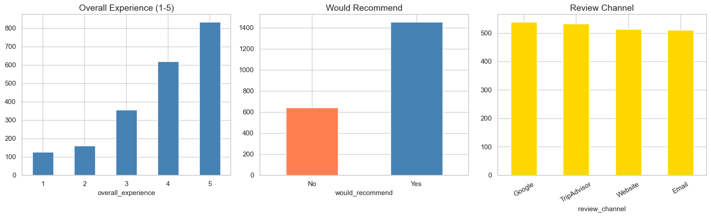
    


`Insights:`
- Shape: (2047, 37)
- Missing values: 0
- Duplicates: 0
- Numerical Variables: 30 (room_cleanliness, room_comfort, room_size, noise_level, air_conditioning, view, food_quality, food_variety, restaurant_service, bar_service, staff_friendliness, staff_professionalism, receptionist_service, concierge_service, spa_wellness_availability, gym_availability, common_areas_quality, quiet_relaxation_areas, conference_work_facilities, privacy_work_spaces, pool_availability, cleanliness_common_areas, activities_quality, activities_variety, excursions_quality, value_for_money, overall_experience, would_recommend, had_complaints, complaints_resolved)
- Categorical Variables: 7 (review_id, booking_id, guest_id, stay_id, review_date, review_channel, review_text)
- 

### Average Ratings by Category


```python

rating_cols = [
    'room_cleanliness', 'room_comfort', 'room_size', 'noise_level',
    'food_quality', 'food_variety', 'restaurant_service', 'bar_service',
    'staff_friendliness', 'staff_professionalism',
    'spa_wellness_availability', 'gym_availability', 'pool_availability',
    'activities_quality', 'activities_variety', 'excursions_quality',
    'value_for_money'
]

avg_ratings = df_reviews[rating_cols].mean().sort_values()

fig, ax = plt.subplots(figsize=(14, 7))
avg_ratings.plot(kind='barh', ax=ax, color='steelblue', edgecolor='white')
ax.set_title('Average Ratings by Category (1-5)')
ax.set_xlabel('Average Rating')
ax.axvline(x=3, color='red', linestyle='--', alpha=0.5, label='Neutral (3)')
ax.legend()
plt.tight_layout()
plt.savefig("..\Images\EDA\Reviews\Average_rating.png")
plt.show()
```


    
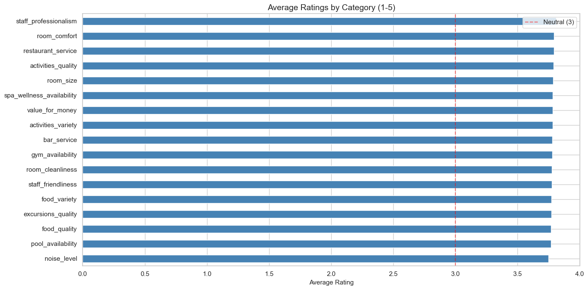
    


### Complaints Impact on Reviews


```python

fig, ax = plt.subplots(figsize=(10, 5))

df_reviews[df_reviews['complaints_resolved'] != -1].groupby(
    ['had_complaints', 'complaints_resolved']
)['overall_experience'].mean().unstack().plot(
    kind='bar', ax=ax, color=['coral', 'steelblue'], edgecolor='white'
)
ax.set_title('Average Overall Experience by Complaint Status')
ax.set_xticklabels(['Had Complaints'], rotation=0)
ax.legend(['Not Resolved', 'Resolved'])
plt.tight_layout()
plt.savefig(r"..\Images\EDA\Reviews\Complaints_impact.png", dpi=150, bbox_inches='tight')
plt.show()
```


    
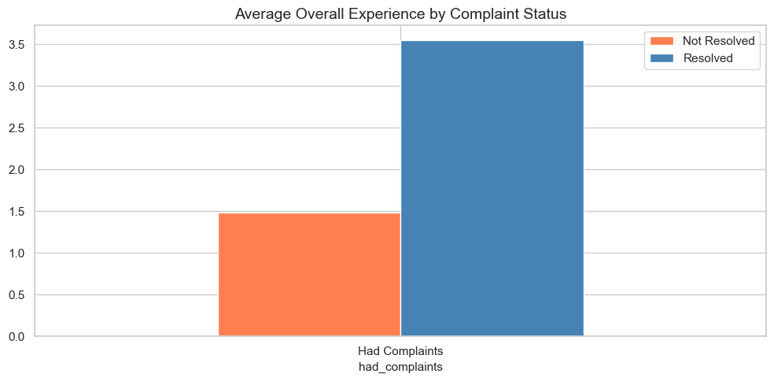
    


-------

## Complaints_Log

### Data Overview


```python
print("\nData head")
display(df_complaints.head(4))
print('\nShape:')
print(df_complaints.shape)
print('\nData info:')
print(df_complaints.info())
print('\nMissing Values:')
print(df_complaints.isnull().sum())
print("\nDuplicate Values:")
print(df_complaints.duplicated().sum())
print('\nSeverity Distribution:')
print(df_complaints['complaint_severity'].value_counts())
print('\nResolution Rate:')
print(df_complaints['resolved'].value_counts(normalize=True).mul(100).round(1))
print("\nNumerical columns:")
display(df_complaints.select_dtypes(include="number").head(2))
print("\nCategorical columns")
display(df_complaints.select_dtypes(exclude="number").head(2))
```

    
    Data head
    


<div>
<style scoped>
    .dataframe tbody tr th:only-of-type {
        vertical-align: middle;
    }

    .dataframe tbody tr th {
        vertical-align: top;
    }

    .dataframe thead th {
        text-align: right;
    }
</style>
<table border="1" class="dataframe">
  <thead>
    <tr style="text-align: right;">
      <th></th>
      <th>complaint_id</th>
      <th>stay_id</th>
      <th>booking_id</th>
      <th>guest_id</th>
      <th>complaint_date</th>
      <th>complaint_time</th>
      <th>complaint_type</th>
      <th>complaint_description</th>
      <th>complaint_severity</th>
      <th>reported_to</th>
      <th>response_time_minutes</th>
      <th>action_taken</th>
      <th>resolved</th>
      <th>resolution_time_minutes</th>
      <th>resolved_by</th>
      <th>follow_up_done</th>
      <th>follow_up_date</th>
      <th>guest_satisfied_after</th>
      <th>compensation_offered</th>
      <th>compensation_type</th>
      <th>compensation_value</th>
    </tr>
  </thead>
  <tbody>
    <tr>
      <th>0</th>
      <td>C000001</td>
      <td>S000003</td>
      <td>B000542</td>
      <td>G02982</td>
      <td>2024-09-13</td>
      <td>18:30</td>
      <td>Other</td>
      <td>Issue not covered by standard categories.</td>
      <td>Medium</td>
      <td>Reception</td>
      <td>22</td>
      <td>Service replacement arranged</td>
      <td>1</td>
      <td>82</td>
      <td>Reception</td>
      <td>0</td>
      <td>No Follow Up</td>
      <td>-1</td>
      <td>0</td>
      <td>No Compensation</td>
      <td>0.0</td>
    </tr>
    <tr>
      <th>1</th>
      <td>C000002</td>
      <td>S000003</td>
      <td>B000542</td>
      <td>G02982</td>
      <td>2024-09-13</td>
      <td>09:30</td>
      <td>Restaurant Service</td>
      <td>Service at the restaurant was extremely slow.</td>
      <td>Low</td>
      <td>Manager</td>
      <td>106</td>
      <td>Sent housekeeping</td>
      <td>1</td>
      <td>170</td>
      <td>Manager</td>
      <td>1</td>
      <td>2024-09-14</td>
      <td>1</td>
      <td>0</td>
      <td>No Compensation</td>
      <td>0.0</td>
    </tr>
    <tr>
      <th>2</th>
      <td>C000003</td>
      <td>S000004</td>
      <td>B000346</td>
      <td>G02487</td>
      <td>2023-08-04</td>
      <td>16:00</td>
      <td>Staff Behavior</td>
      <td>Other issue reported.</td>
      <td>Medium</td>
      <td>Manager</td>
      <td>17</td>
      <td>Noted complaint in system</td>
      <td>0</td>
      <td>-1</td>
      <td>Not Resolved</td>
      <td>0</td>
      <td>No Follow Up</td>
      <td>-1</td>
      <td>0</td>
      <td>No Compensation</td>
      <td>0.0</td>
    </tr>
    <tr>
      <th>3</th>
      <td>C000004</td>
      <td>S000007</td>
      <td>B001704</td>
      <td>G02522</td>
      <td>2024-08-15</td>
      <td>17:30</td>
      <td>Room Condition</td>
      <td>Other issue reported.</td>
      <td>Medium</td>
      <td>Reception</td>
      <td>36</td>
      <td>Room change offered</td>
      <td>1</td>
      <td>189</td>
      <td>Manager</td>
      <td>1</td>
      <td>2024-08-18</td>
      <td>1</td>
      <td>0</td>
      <td>No Compensation</td>
      <td>0.0</td>
    </tr>
  </tbody>
</table>
</div>


    
    Shape:
    (1698, 21)
    
    Data info:
    <class 'pandas.DataFrame'>
    RangeIndex: 1698 entries, 0 to 1697
    Data columns (total 21 columns):
     #   Column                   Non-Null Count  Dtype  
    ---  ------                   --------------  -----  
     0   complaint_id             1698 non-null   str    
     1   stay_id                  1698 non-null   str    
     2   booking_id               1698 non-null   str    
     3   guest_id                 1698 non-null   str    
     4   complaint_date           1698 non-null   str    
     5   complaint_time           1698 non-null   str    
     6   complaint_type           1698 non-null   str    
     7   complaint_description    1698 non-null   str    
     8   complaint_severity       1698 non-null   str    
     9   reported_to              1698 non-null   str    
     10  response_time_minutes    1698 non-null   int64  
     11  action_taken             1698 non-null   str    
     12  resolved                 1698 non-null   int64  
     13  resolution_time_minutes  1698 non-null   int64  
     14  resolved_by              1698 non-null   str    
     15  follow_up_done           1698 non-null   int64  
     16  follow_up_date           1698 non-null   str    
     17  guest_satisfied_after    1698 non-null   int64  
     18  compensation_offered     1698 non-null   int64  
     19  compensation_type        1698 non-null   str    
     20  compensation_value       1698 non-null   float64
    dtypes: float64(1), int64(6), str(14)
    memory usage: 278.7 KB
    None
    
    Missing Values:
    complaint_id               0
    stay_id                    0
    booking_id                 0
    guest_id                   0
    complaint_date             0
    complaint_time             0
    complaint_type             0
    complaint_description      0
    complaint_severity         0
    reported_to                0
    response_time_minutes      0
    action_taken               0
    resolved                   0
    resolution_time_minutes    0
    resolved_by                0
    follow_up_done             0
    follow_up_date             0
    guest_satisfied_after      0
    compensation_offered       0
    compensation_type          0
    compensation_value         0
    dtype: int64
    
    Duplicate Values:
    0
    
    Severity Distribution:
    complaint_severity
    Low         773
    Medium      705
    High        159
    Critical     61
    Name: count, dtype: int64
    
    Resolution Rate:
    resolved
    1    68.9
    0    31.1
    Name: proportion, dtype: float64
    
    Numerical columns:
    


<div>
<style scoped>
    .dataframe tbody tr th:only-of-type {
        vertical-align: middle;
    }

    .dataframe tbody tr th {
        vertical-align: top;
    }

    .dataframe thead th {
        text-align: right;
    }
</style>
<table border="1" class="dataframe">
  <thead>
    <tr style="text-align: right;">
      <th></th>
      <th>response_time_minutes</th>
      <th>resolved</th>
      <th>resolution_time_minutes</th>
      <th>follow_up_done</th>
      <th>guest_satisfied_after</th>
      <th>compensation_offered</th>
      <th>compensation_value</th>
    </tr>
  </thead>
  <tbody>
    <tr>
      <th>0</th>
      <td>22</td>
      <td>1</td>
      <td>82</td>
      <td>0</td>
      <td>-1</td>
      <td>0</td>
      <td>0.0</td>
    </tr>
    <tr>
      <th>1</th>
      <td>106</td>
      <td>1</td>
      <td>170</td>
      <td>1</td>
      <td>1</td>
      <td>0</td>
      <td>0.0</td>
    </tr>
  </tbody>
</table>
</div>


    
    Categorical columns
    


<div>
<style scoped>
    .dataframe tbody tr th:only-of-type {
        vertical-align: middle;
    }

    .dataframe tbody tr th {
        vertical-align: top;
    }

    .dataframe thead th {
        text-align: right;
    }
</style>
<table border="1" class="dataframe">
  <thead>
    <tr style="text-align: right;">
      <th></th>
      <th>complaint_id</th>
      <th>stay_id</th>
      <th>booking_id</th>
      <th>guest_id</th>
      <th>complaint_date</th>
      <th>complaint_time</th>
      <th>complaint_type</th>
      <th>complaint_description</th>
      <th>complaint_severity</th>
      <th>reported_to</th>
      <th>action_taken</th>
      <th>resolved_by</th>
      <th>follow_up_date</th>
      <th>compensation_type</th>
    </tr>
  </thead>
  <tbody>
    <tr>
      <th>0</th>
      <td>C000001</td>
      <td>S000003</td>
      <td>B000542</td>
      <td>G02982</td>
      <td>2024-09-13</td>
      <td>18:30</td>
      <td>Other</td>
      <td>Issue not covered by standard categories.</td>
      <td>Medium</td>
      <td>Reception</td>
      <td>Service replacement arranged</td>
      <td>Reception</td>
      <td>No Follow Up</td>
      <td>No Compensation</td>
    </tr>
    <tr>
      <th>1</th>
      <td>C000002</td>
      <td>S000003</td>
      <td>B000542</td>
      <td>G02982</td>
      <td>2024-09-13</td>
      <td>09:30</td>
      <td>Restaurant Service</td>
      <td>Service at the restaurant was extremely slow.</td>
      <td>Low</td>
      <td>Manager</td>
      <td>Sent housekeeping</td>
      <td>Manager</td>
      <td>2024-09-14</td>
      <td>No Compensation</td>
    </tr>
  </tbody>
</table>
</div>


### Complaint Types and Severity


```python

fig, axes = plt.subplots(1, 2, figsize=(16, 6))

df_complaints['complaint_type'].value_counts().head(10).plot(
    kind='barh', ax=axes[0], color='coral', edgecolor='white'
)
axes[0].set_title('Top 10 Complaint Types')

severity_order = ['Low', 'Medium', 'High', 'Critical']
df_complaints['complaint_severity'].value_counts().reindex(severity_order).plot(
    kind='bar', ax=axes[1], color=['steelblue', 'gold', 'coral', 'crimson'], edgecolor='white'
)
axes[1].set_title('Complaint Severity Distribution')
axes[1].tick_params(axis='x', rotation=0)

plt.tight_layout()
plt.savefig("..\Images\EDA\Complaint\Complaints_types.png")
plt.show()
```


    
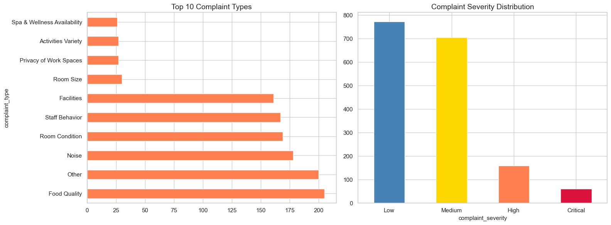
    


### Response Time by Severity


```python

fig, axes = plt.subplots(1, 2, figsize=(14, 5))

df_complaints.groupby('complaint_severity')['response_time_minutes'].mean().reindex(
    severity_order
).plot(kind='bar', ax=axes[0], color=['steelblue', 'gold', 'coral', 'crimson'], edgecolor='white')
axes[0].set_title('Avg Response Time by Severity (minutes)')
axes[0].tick_params(axis='x', rotation=0)

df_complaints[df_complaints['resolved'] == 1].groupby(
    'complaint_severity'
)['resolution_time_minutes'].mean().reindex(severity_order).plot(
    kind='bar', ax=axes[1], color=['steelblue', 'gold', 'coral', 'crimson'], edgecolor='white'
)
axes[1].set_title('Avg Resolution Time by Severity (minutes)')
axes[1].tick_params(axis='x', rotation=0)

plt.tight_layout()
plt.savefig("..\Images\EDA\Complaint\Response_time.png")
plt.show()
```


    
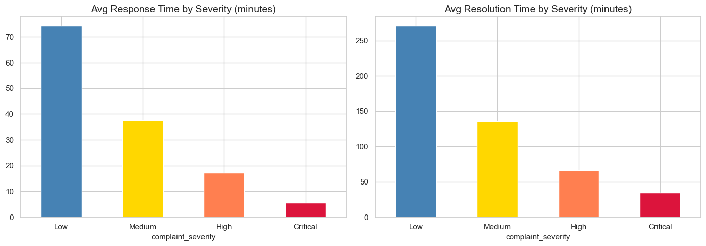
    


### Compensation Analysis


```python

comp_rate = df_complaints['compensation_offered'].mean() * 100
print(f'Compensation Offered Rate: {comp_rate:.1f}%')

fig, axes = plt.subplots(1, 2, figsize=(14, 5))

df_complaints[df_complaints['compensation_offered'] == 1]['compensation_type'].value_counts().plot(
    kind='bar', ax=axes[0], color='gold', edgecolor='white'
)
axes[0].set_title('Compensation Types Offered')
axes[0].tick_params(axis='x', rotation=30)

df_complaints[df_complaints['compensation_offered'] == 1].groupby(
    'compensation_type'
)['compensation_value'].mean().plot(
    kind='bar', ax=axes[1], color='gold', edgecolor='white'
)
axes[1].set_title('Avg Compensation Value by Type (€)')
axes[1].tick_params(axis='x', rotation=30)

plt.tight_layout()
plt.savefig("..\Images\EDA\Complaint\Compensation_Analysis.png")
plt.show()
```

    Compensation Offered Rate: 8.7%
    


    
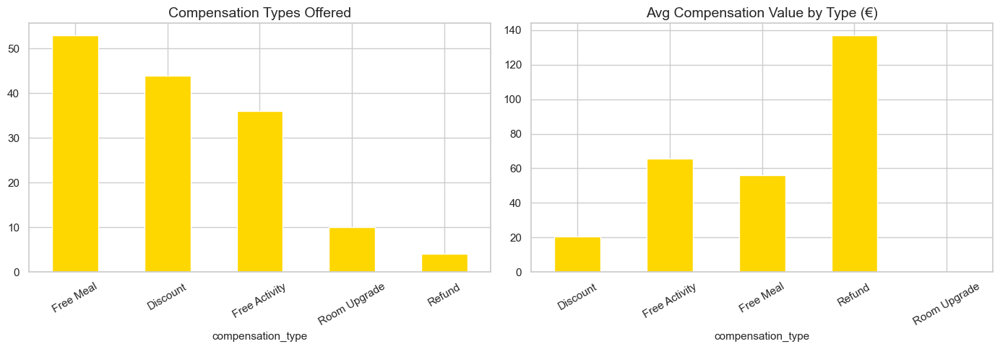
    


----

## ACTIVITY_CATALOG & ACTIVITY_PREFERENCES

### Data Overview - ACTIVITY_CATALOG


```python
print("\nData head")
display(df_act_catalog.head(4))
print('\nShape:')
print(df_act_catalog.shape)
print('\nData info:')
print(df_act_catalog.info())
print('\nMissing Values:')
print(df_act_catalog.isnull().sum())
print("\nDuplicate Values:")
print(df_act_catalog.duplicated().sum())
print("\nNumerical columns:")
display(df_act_catalog.select_dtypes(include="number").head(2))
print("\nCategorical columns")
display(df_act_catalog.select_dtypes(exclude="number").head(2))
```

    
    Data head
    


<div>
<style scoped>
    .dataframe tbody tr th:only-of-type {
        vertical-align: middle;
    }

    .dataframe tbody tr th {
        vertical-align: top;
    }

    .dataframe thead th {
        text-align: right;
    }
</style>
<table border="1" class="dataframe">
  <thead>
    <tr style="text-align: right;">
      <th></th>
      <th>activity_id</th>
      <th>activity_name</th>
      <th>activity_category</th>
      <th>description</th>
      <th>price_range</th>
      <th>duration_hours</th>
      <th>physical_intensity</th>
      <th>min_age</th>
      <th>wheelchair_accessible</th>
      <th>visual_impaired_friendly</th>
      <th>hearing_impaired_friendly</th>
      <th>slow_pace_available</th>
      <th>max_walking_distance</th>
      <th>suitable_for_kids</th>
      <th>suitable_for_seniors</th>
      <th>suitable_for_families</th>
      <th>suitable_for_couples</th>
      <th>suitable_for_solo</th>
      <th>suitable_life_trip_low_budget</th>
      <th>suitable_valentines</th>
      <th>suitable_anniversary</th>
      <th>suitable_birthday</th>
      <th>suitable_honeymoon</th>
      <th>suitable_life_trip</th>
    </tr>
  </thead>
  <tbody>
    <tr>
      <th>0</th>
      <td>ACT001</td>
      <td>Surf</td>
      <td>Water &amp; Sea</td>
      <td>Dynamic water sport ideal for adventurous gues...</td>
      <td>Medium</td>
      <td>3.0</td>
      <td>High</td>
      <td>12</td>
      <td>0</td>
      <td>0</td>
      <td>1</td>
      <td>0</td>
      <td>Long</td>
      <td>0</td>
      <td>0</td>
      <td>0</td>
      <td>1</td>
      <td>1</td>
      <td>0</td>
      <td>0</td>
      <td>0</td>
      <td>1</td>
      <td>0</td>
      <td>1</td>
    </tr>
    <tr>
      <th>1</th>
      <td>ACT002</td>
      <td>Stand-up Paddle</td>
      <td>Water &amp; Sea</td>
      <td>Relaxing paddleboarding on calm waters. Suitab...</td>
      <td>Medium</td>
      <td>2.0</td>
      <td>Moderate</td>
      <td>10</td>
      <td>0</td>
      <td>0</td>
      <td>1</td>
      <td>0</td>
      <td>Short</td>
      <td>0</td>
      <td>0</td>
      <td>1</td>
      <td>1</td>
      <td>1</td>
      <td>1</td>
      <td>0</td>
      <td>1</td>
      <td>1</td>
      <td>1</td>
      <td>1</td>
    </tr>
    <tr>
      <th>2</th>
      <td>ACT003</td>
      <td>Kayaking</td>
      <td>Water &amp; Sea</td>
      <td>Scenic kayaking experience on rivers or sea. S...</td>
      <td>Medium</td>
      <td>3.0</td>
      <td>Moderate</td>
      <td>10</td>
      <td>0</td>
      <td>0</td>
      <td>1</td>
      <td>0</td>
      <td>Short</td>
      <td>1</td>
      <td>0</td>
      <td>1</td>
      <td>1</td>
      <td>1</td>
      <td>1</td>
      <td>0</td>
      <td>1</td>
      <td>1</td>
      <td>1</td>
      <td>1</td>
    </tr>
    <tr>
      <th>3</th>
      <td>ACT004</td>
      <td>Canoeing</td>
      <td>Water &amp; Sea</td>
      <td>Peaceful canoeing on calm waters. Ideal for fa...</td>
      <td>Medium</td>
      <td>3.0</td>
      <td>Moderate</td>
      <td>10</td>
      <td>0</td>
      <td>0</td>
      <td>1</td>
      <td>0</td>
      <td>Short</td>
      <td>1</td>
      <td>0</td>
      <td>1</td>
      <td>1</td>
      <td>1</td>
      <td>1</td>
      <td>0</td>
      <td>1</td>
      <td>1</td>
      <td>1</td>
      <td>1</td>
    </tr>
  </tbody>
</table>
</div>


    
    Shape:
    (81, 24)
    
    Data info:
    <class 'pandas.DataFrame'>
    RangeIndex: 81 entries, 0 to 80
    Data columns (total 24 columns):
     #   Column                         Non-Null Count  Dtype  
    ---  ------                         --------------  -----  
     0   activity_id                    81 non-null     str    
     1   activity_name                  81 non-null     str    
     2   activity_category              81 non-null     str    
     3   description                    81 non-null     str    
     4   price_range                    81 non-null     str    
     5   duration_hours                 81 non-null     float64
     6   physical_intensity             81 non-null     str    
     7   min_age                        81 non-null     int64  
     8   wheelchair_accessible          81 non-null     int64  
     9   visual_impaired_friendly       81 non-null     int64  
     10  hearing_impaired_friendly      81 non-null     int64  
     11  slow_pace_available            81 non-null     int64  
     12  max_walking_distance           81 non-null     str    
     13  suitable_for_kids              81 non-null     int64  
     14  suitable_for_seniors           81 non-null     int64  
     15  suitable_for_families          81 non-null     int64  
     16  suitable_for_couples           81 non-null     int64  
     17  suitable_for_solo              81 non-null     int64  
     18  suitable_life_trip_low_budget  81 non-null     int64  
     19  suitable_valentines            81 non-null     int64  
     20  suitable_anniversary           81 non-null     int64  
     21  suitable_birthday              81 non-null     int64  
     22  suitable_honeymoon             81 non-null     int64  
     23  suitable_life_trip             81 non-null     int64  
    dtypes: float64(1), int64(16), str(7)
    memory usage: 15.3 KB
    None
    
    Missing Values:
    activity_id                      0
    activity_name                    0
    activity_category                0
    description                      0
    price_range                      0
    duration_hours                   0
    physical_intensity               0
    min_age                          0
    wheelchair_accessible            0
    visual_impaired_friendly         0
    hearing_impaired_friendly        0
    slow_pace_available              0
    max_walking_distance             0
    suitable_for_kids                0
    suitable_for_seniors             0
    suitable_for_families            0
    suitable_for_couples             0
    suitable_for_solo                0
    suitable_life_trip_low_budget    0
    suitable_valentines              0
    suitable_anniversary             0
    suitable_birthday                0
    suitable_honeymoon               0
    suitable_life_trip               0
    dtype: int64
    
    Duplicate Values:
    0
    
    Numerical columns:
    


<div>
<style scoped>
    .dataframe tbody tr th:only-of-type {
        vertical-align: middle;
    }

    .dataframe tbody tr th {
        vertical-align: top;
    }

    .dataframe thead th {
        text-align: right;
    }
</style>
<table border="1" class="dataframe">
  <thead>
    <tr style="text-align: right;">
      <th></th>
      <th>duration_hours</th>
      <th>min_age</th>
      <th>wheelchair_accessible</th>
      <th>visual_impaired_friendly</th>
      <th>hearing_impaired_friendly</th>
      <th>slow_pace_available</th>
      <th>suitable_for_kids</th>
      <th>suitable_for_seniors</th>
      <th>suitable_for_families</th>
      <th>suitable_for_couples</th>
      <th>suitable_for_solo</th>
      <th>suitable_life_trip_low_budget</th>
      <th>suitable_valentines</th>
      <th>suitable_anniversary</th>
      <th>suitable_birthday</th>
      <th>suitable_honeymoon</th>
      <th>suitable_life_trip</th>
    </tr>
  </thead>
  <tbody>
    <tr>
      <th>0</th>
      <td>3.0</td>
      <td>12</td>
      <td>0</td>
      <td>0</td>
      <td>1</td>
      <td>0</td>
      <td>0</td>
      <td>0</td>
      <td>0</td>
      <td>1</td>
      <td>1</td>
      <td>0</td>
      <td>0</td>
      <td>0</td>
      <td>1</td>
      <td>0</td>
      <td>1</td>
    </tr>
    <tr>
      <th>1</th>
      <td>2.0</td>
      <td>10</td>
      <td>0</td>
      <td>0</td>
      <td>1</td>
      <td>0</td>
      <td>0</td>
      <td>0</td>
      <td>1</td>
      <td>1</td>
      <td>1</td>
      <td>1</td>
      <td>0</td>
      <td>1</td>
      <td>1</td>
      <td>1</td>
      <td>1</td>
    </tr>
  </tbody>
</table>
</div>


    
    Categorical columns
    


<div>
<style scoped>
    .dataframe tbody tr th:only-of-type {
        vertical-align: middle;
    }

    .dataframe tbody tr th {
        vertical-align: top;
    }

    .dataframe thead th {
        text-align: right;
    }
</style>
<table border="1" class="dataframe">
  <thead>
    <tr style="text-align: right;">
      <th></th>
      <th>activity_id</th>
      <th>activity_name</th>
      <th>activity_category</th>
      <th>description</th>
      <th>price_range</th>
      <th>physical_intensity</th>
      <th>max_walking_distance</th>
    </tr>
  </thead>
  <tbody>
    <tr>
      <th>0</th>
      <td>ACT001</td>
      <td>Surf</td>
      <td>Water &amp; Sea</td>
      <td>Dynamic water sport ideal for adventurous gues...</td>
      <td>Medium</td>
      <td>High</td>
      <td>Long</td>
    </tr>
    <tr>
      <th>1</th>
      <td>ACT002</td>
      <td>Stand-up Paddle</td>
      <td>Water &amp; Sea</td>
      <td>Relaxing paddleboarding on calm waters. Suitab...</td>
      <td>Medium</td>
      <td>Moderate</td>
      <td>Short</td>
    </tr>
  </tbody>
</table>
</div>


### Activity Catalog Overview


```python
fig, axes = plt.subplots(1, 2, figsize=(14, 5))

df_act_catalog['activity_category'].value_counts().plot(
    kind='barh', ax=axes[0], color='steelblue', edgecolor='white'
)
axes[0].set_title('Activities by Category')

df_act_catalog['price_range'].value_counts().reindex(
    ['Free', 'Low', 'Medium', 'High', 'Premium']
).plot(
    kind='bar', ax=axes[1], color='coral', edgecolor='white'
)
axes[1].set_title('Activities by Price Range')
axes[1].tick_params(axis='x', rotation=0)

plt.tight_layout()
plt.savefig("..\Images\EDA\Activities\Catalog_overview.png")
plt.show()
```


    
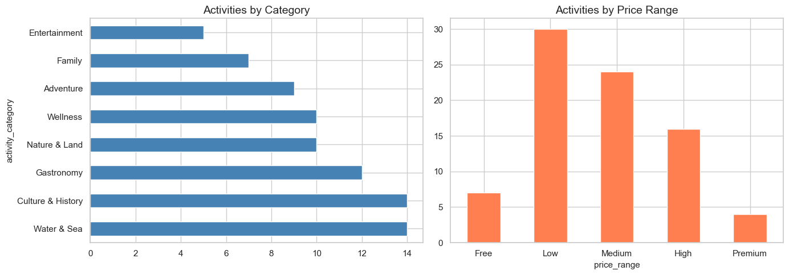
    


### Data Overview - ACTIVITY_PREFERENCES


```python
print("\nData head")
display(df_act_preferences.head(4))
print('\nShape:')
print(df_act_preferences.shape)
print('\nData info:')
print(df_act_preferences.info())
print('\nMissing Values:')
print(df_act_preferences.isnull().sum())
print("\nDuplicate Values:")
print(df_act_preferences.duplicated().sum())
print("\nNumerical columns:")
display(df_act_preferences.select_dtypes(include="number").head(2))
print("\nCategorical columns")
display(df_act_preferences.select_dtypes(exclude="number").head(2))
```

    
    Data head
    


<div>
<style scoped>
    .dataframe tbody tr th:only-of-type {
        vertical-align: middle;
    }

    .dataframe tbody tr th {
        vertical-align: top;
    }

    .dataframe thead th {
        text-align: right;
    }
</style>
<table border="1" class="dataframe">
  <thead>
    <tr style="text-align: right;">
      <th></th>
      <th>preference_id</th>
      <th>guest_id</th>
      <th>booking_id</th>
      <th>stay_id</th>
      <th>declared_interests</th>
      <th>declared_activity_level</th>
      <th>preferred_time_of_day</th>
      <th>preferred_group_size</th>
      <th>seasonal_preference</th>
      <th>enquiry_type</th>
      <th>enquiry_detail</th>
      <th>enquiry_converted</th>
      <th>activities_attended</th>
      <th>excursions_booked</th>
      <th>preferred_activity_type</th>
      <th>special_occasion</th>
      <th>life_trip</th>
      <th>life_trip_budget</th>
      <th>life_trip_gesture_offered</th>
      <th>life_trip_gesture_type</th>
      <th>kids_activities_needed</th>
      <th>kids_age_group</th>
      <th>family_activity_requested</th>
      <th>slow_pace_required</th>
      <th>mobility_aid_type</th>
      <th>visual_impairment</th>
      <th>hearing_impairment</th>
      <th>speech_impairment</th>
      <th>max_walking_distance</th>
      <th>adapted_activity_requested</th>
      <th>adapted_activity_provided</th>
      <th>last_updated</th>
    </tr>
  </thead>
  <tbody>
    <tr>
      <th>0</th>
      <td>P000001</td>
      <td>G01715</td>
      <td>B002310</td>
      <td>S000001</td>
      <td>Family</td>
      <td>High</td>
      <td>Afternoon</td>
      <td>Group</td>
      <td>Spring</td>
      <td>Facility</td>
      <td>ACT072</td>
      <td>1</td>
      <td>ACT075, ACT070</td>
      <td>No Excursions</td>
      <td>Family</td>
      <td>No Occasions</td>
      <td>0</td>
      <td>Not a Life Trip</td>
      <td>0</td>
      <td>No Gesture</td>
      <td>0</td>
      <td>No Kids</td>
      <td>0</td>
      <td>0</td>
      <td>No Mobility Aid</td>
      <td>No Impairment</td>
      <td>No Impairment</td>
      <td>No Impairment</td>
      <td>Long</td>
      <td>0</td>
      <td>0</td>
      <td>2026-03-09</td>
    </tr>
    <tr>
      <th>1</th>
      <td>P000002</td>
      <td>G03129</td>
      <td>B001037</td>
      <td>S000002</td>
      <td>Entertainment</td>
      <td>Moderate</td>
      <td>Afternoon</td>
      <td>Group</td>
      <td>Autumn</td>
      <td>Facility</td>
      <td>ACT068</td>
      <td>1</td>
      <td>ACT068, ACT064</td>
      <td>No Excursions</td>
      <td>Entertainment</td>
      <td>No Occasions</td>
      <td>0</td>
      <td>Not a Life Trip</td>
      <td>0</td>
      <td>No Gesture</td>
      <td>0</td>
      <td>No Kids</td>
      <td>0</td>
      <td>0</td>
      <td>No Mobility Aid</td>
      <td>No Impairment</td>
      <td>No Impairment</td>
      <td>No Impairment</td>
      <td>Long</td>
      <td>0</td>
      <td>0</td>
      <td>2026-03-09</td>
    </tr>
    <tr>
      <th>2</th>
      <td>P000003</td>
      <td>G02982</td>
      <td>B000542</td>
      <td>S000003</td>
      <td>Adventure</td>
      <td>High</td>
      <td>Evening</td>
      <td>Solo</td>
      <td>Autumn</td>
      <td>Activity</td>
      <td>ACT018</td>
      <td>1</td>
      <td>ACT017</td>
      <td>ACT001, ACT028</td>
      <td>Adventure</td>
      <td>No Occasions</td>
      <td>0</td>
      <td>Not a Life Trip</td>
      <td>0</td>
      <td>No Gesture</td>
      <td>0</td>
      <td>No Kids</td>
      <td>0</td>
      <td>0</td>
      <td>No Mobility Aid</td>
      <td>No Impairment</td>
      <td>No Impairment</td>
      <td>No Impairment</td>
      <td>Long</td>
      <td>0</td>
      <td>0</td>
      <td>2026-03-09</td>
    </tr>
    <tr>
      <th>3</th>
      <td>P000004</td>
      <td>G02487</td>
      <td>B000346</td>
      <td>S000004</td>
      <td>Wellness</td>
      <td>Moderate</td>
      <td>Morning</td>
      <td>Couple</td>
      <td>Summer</td>
      <td>Excursion</td>
      <td>ACT080</td>
      <td>0</td>
      <td>ACT072, ACT054, ACT062, ACT063</td>
      <td>ACT011, ACT030</td>
      <td>Gastronomy</td>
      <td>Valentines</td>
      <td>0</td>
      <td>Not a Life Trip</td>
      <td>0</td>
      <td>No Gesture</td>
      <td>1</td>
      <td>Child</td>
      <td>0</td>
      <td>0</td>
      <td>No Mobility Aid</td>
      <td>No Impairment</td>
      <td>No Impairment</td>
      <td>No Impairment</td>
      <td>Long</td>
      <td>0</td>
      <td>0</td>
      <td>2026-03-09</td>
    </tr>
  </tbody>
</table>
</div>


    
    Shape:
    (3021, 32)
    
    Data info:
    <class 'pandas.DataFrame'>
    RangeIndex: 3021 entries, 0 to 3020
    Data columns (total 32 columns):
     #   Column                      Non-Null Count  Dtype
    ---  ------                      --------------  -----
     0   preference_id               3021 non-null   str  
     1   guest_id                    3021 non-null   str  
     2   booking_id                  3021 non-null   str  
     3   stay_id                     3021 non-null   str  
     4   declared_interests          3021 non-null   str  
     5   declared_activity_level     3021 non-null   str  
     6   preferred_time_of_day       3021 non-null   str  
     7   preferred_group_size        3021 non-null   str  
     8   seasonal_preference         3021 non-null   str  
     9   enquiry_type                3021 non-null   str  
     10  enquiry_detail              3021 non-null   str  
     11  enquiry_converted           3021 non-null   int64
     12  activities_attended         3021 non-null   str  
     13  excursions_booked           3021 non-null   str  
     14  preferred_activity_type     3021 non-null   str  
     15  special_occasion            3021 non-null   str  
     16  life_trip                   3021 non-null   int64
     17  life_trip_budget            3021 non-null   str  
     18  life_trip_gesture_offered   3021 non-null   int64
     19  life_trip_gesture_type      3021 non-null   str  
     20  kids_activities_needed      3021 non-null   int64
     21  kids_age_group              3021 non-null   str  
     22  family_activity_requested   3021 non-null   int64
     23  slow_pace_required          3021 non-null   int64
     24  mobility_aid_type           3021 non-null   str  
     25  visual_impairment           3021 non-null   str  
     26  hearing_impairment          3021 non-null   str  
     27  speech_impairment           3021 non-null   str  
     28  max_walking_distance        3021 non-null   str  
     29  adapted_activity_requested  3021 non-null   int64
     30  adapted_activity_provided   3021 non-null   int64
     31  last_updated                3021 non-null   str  
    dtypes: int64(8), str(24)
    memory usage: 755.4 KB
    None
    
    Missing Values:
    preference_id                 0
    guest_id                      0
    booking_id                    0
    stay_id                       0
    declared_interests            0
    declared_activity_level       0
    preferred_time_of_day         0
    preferred_group_size          0
    seasonal_preference           0
    enquiry_type                  0
    enquiry_detail                0
    enquiry_converted             0
    activities_attended           0
    excursions_booked             0
    preferred_activity_type       0
    special_occasion              0
    life_trip                     0
    life_trip_budget              0
    life_trip_gesture_offered     0
    life_trip_gesture_type        0
    kids_activities_needed        0
    kids_age_group                0
    family_activity_requested     0
    slow_pace_required            0
    mobility_aid_type             0
    visual_impairment             0
    hearing_impairment            0
    speech_impairment             0
    max_walking_distance          0
    adapted_activity_requested    0
    adapted_activity_provided     0
    last_updated                  0
    dtype: int64
    
    Duplicate Values:
    0
    
    Numerical columns:
    


<div>
<style scoped>
    .dataframe tbody tr th:only-of-type {
        vertical-align: middle;
    }

    .dataframe tbody tr th {
        vertical-align: top;
    }

    .dataframe thead th {
        text-align: right;
    }
</style>
<table border="1" class="dataframe">
  <thead>
    <tr style="text-align: right;">
      <th></th>
      <th>enquiry_converted</th>
      <th>life_trip</th>
      <th>life_trip_gesture_offered</th>
      <th>kids_activities_needed</th>
      <th>family_activity_requested</th>
      <th>slow_pace_required</th>
      <th>adapted_activity_requested</th>
      <th>adapted_activity_provided</th>
    </tr>
  </thead>
  <tbody>
    <tr>
      <th>0</th>
      <td>1</td>
      <td>0</td>
      <td>0</td>
      <td>0</td>
      <td>0</td>
      <td>0</td>
      <td>0</td>
      <td>0</td>
    </tr>
    <tr>
      <th>1</th>
      <td>1</td>
      <td>0</td>
      <td>0</td>
      <td>0</td>
      <td>0</td>
      <td>0</td>
      <td>0</td>
      <td>0</td>
    </tr>
  </tbody>
</table>
</div>


    
    Categorical columns
    


<div>
<style scoped>
    .dataframe tbody tr th:only-of-type {
        vertical-align: middle;
    }

    .dataframe tbody tr th {
        vertical-align: top;
    }

    .dataframe thead th {
        text-align: right;
    }
</style>
<table border="1" class="dataframe">
  <thead>
    <tr style="text-align: right;">
      <th></th>
      <th>preference_id</th>
      <th>guest_id</th>
      <th>booking_id</th>
      <th>stay_id</th>
      <th>declared_interests</th>
      <th>declared_activity_level</th>
      <th>preferred_time_of_day</th>
      <th>preferred_group_size</th>
      <th>seasonal_preference</th>
      <th>enquiry_type</th>
      <th>enquiry_detail</th>
      <th>activities_attended</th>
      <th>excursions_booked</th>
      <th>preferred_activity_type</th>
      <th>special_occasion</th>
      <th>life_trip_budget</th>
      <th>life_trip_gesture_type</th>
      <th>kids_age_group</th>
      <th>mobility_aid_type</th>
      <th>visual_impairment</th>
      <th>hearing_impairment</th>
      <th>speech_impairment</th>
      <th>max_walking_distance</th>
      <th>last_updated</th>
    </tr>
  </thead>
  <tbody>
    <tr>
      <th>0</th>
      <td>P000001</td>
      <td>G01715</td>
      <td>B002310</td>
      <td>S000001</td>
      <td>Family</td>
      <td>High</td>
      <td>Afternoon</td>
      <td>Group</td>
      <td>Spring</td>
      <td>Facility</td>
      <td>ACT072</td>
      <td>ACT075, ACT070</td>
      <td>No Excursions</td>
      <td>Family</td>
      <td>No Occasions</td>
      <td>Not a Life Trip</td>
      <td>No Gesture</td>
      <td>No Kids</td>
      <td>No Mobility Aid</td>
      <td>No Impairment</td>
      <td>No Impairment</td>
      <td>No Impairment</td>
      <td>Long</td>
      <td>2026-03-09</td>
    </tr>
    <tr>
      <th>1</th>
      <td>P000002</td>
      <td>G03129</td>
      <td>B001037</td>
      <td>S000002</td>
      <td>Entertainment</td>
      <td>Moderate</td>
      <td>Afternoon</td>
      <td>Group</td>
      <td>Autumn</td>
      <td>Facility</td>
      <td>ACT068</td>
      <td>ACT068, ACT064</td>
      <td>No Excursions</td>
      <td>Entertainment</td>
      <td>No Occasions</td>
      <td>Not a Life Trip</td>
      <td>No Gesture</td>
      <td>No Kids</td>
      <td>No Mobility Aid</td>
      <td>No Impairment</td>
      <td>No Impairment</td>
      <td>No Impairment</td>
      <td>Long</td>
      <td>2026-03-09</td>
    </tr>
  </tbody>
</table>
</div>


### Activity Preferences Overview


```python

fig, axes = plt.subplots(1, 2, figsize=(14, 5))

df_act_preferences['declared_interests'].value_counts().plot(
    kind='barh', ax=axes[0], color='steelblue', edgecolor='white'
)
axes[0].set_title('Declared Interests')

df_act_preferences['preferred_activity_type'].value_counts().plot(
    kind='barh', ax=axes[1], color='coral', edgecolor='white'
)
axes[1].set_title('Learned Preferred Activity Type')

plt.tight_layout()
plt.savefig("..\Images\EDA\Activities\preferences_overview.png")
plt.show()
```


    
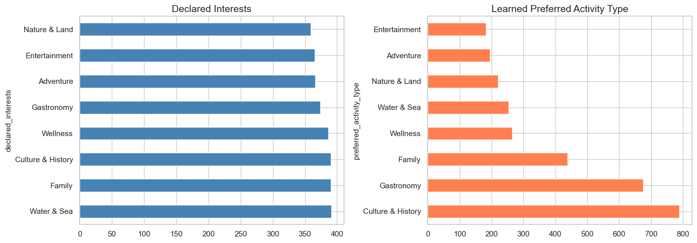
    


### Accessibility in Catalog


```python

accessibility_cols = [
    'wheelchair_accessible', 'visual_impaired_friendly',
    'hearing_impaired_friendly', 'slow_pace_available'
]

accessibility_rates = df_act_catalog[accessibility_cols].mean() * 100

fig, ax = plt.subplots(figsize=(10, 5))
accessibility_rates.plot(kind='bar', ax=ax, color='steelblue', edgecolor='white')
ax.set_title('Accessibility Coverage in Activity Catalog (%)')
ax.set_ylabel('% of Activities')
ax.set_xticklabels([
    'Wheelchair\nAccessible', 'Visual Impaired\nFriendly',
    'Hearing Impaired\nFriendly', 'Slow Pace\nAvailable'
], rotation=0)
plt.tight_layout()
plt.savefig("..\Images\EDA\Activities\Accessibility_coverage.png")
plt.show()
```


    
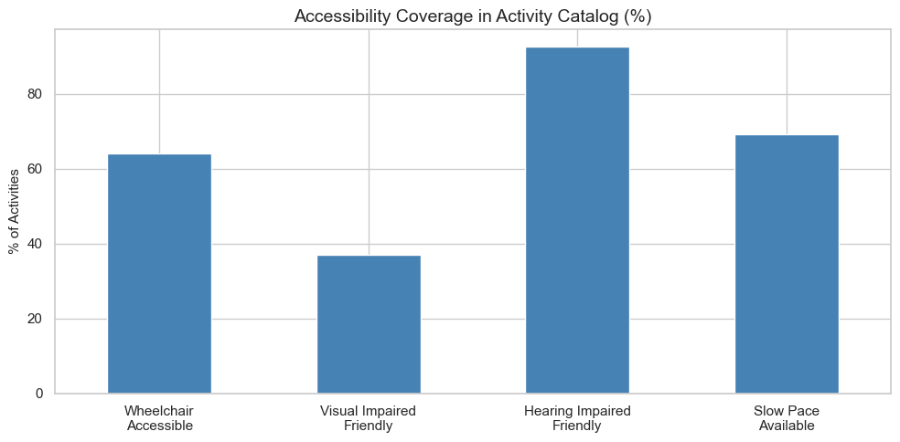
    


### Special Occasions and Life Trip


```python

fig, axes = plt.subplots(1, 2, figsize=(14, 5))

df_act_preferences['special_occasion'].value_counts().plot(
    kind='barh', ax=axes[0], color='gold', edgecolor='white'
)
axes[0].set_title('Special Occasions')

life_trip_budget = df_act_preferences[df_act_preferences['life_trip'] == 1]['life_trip_budget'].value_counts()
life_trip_budget.plot(kind='bar', ax=axes[1], color='coral', edgecolor='white')
axes[1].set_title('Life Trip Budget Distribution')
axes[1].tick_params(axis='x', rotation=0)

plt.tight_layout()
plt.savefig("..\Images\EDA\Activities\Special_ocasion.png")
plt.show()
```


    
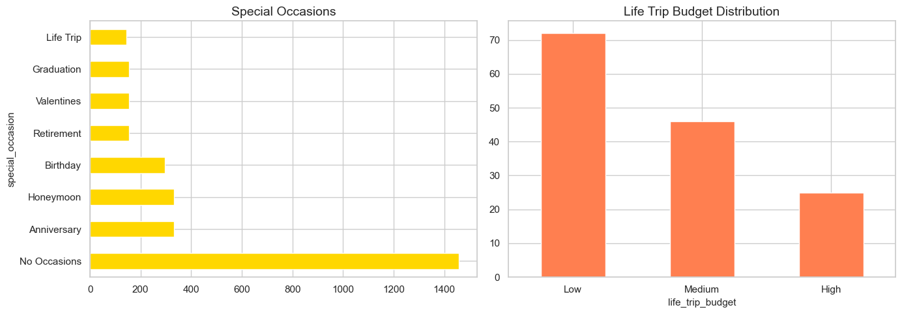
    


---

## KYC ANOMALY SIGNALS SUMMARY


```python
# Consolidate KYC signals
df_kyc_full = df_bookings.merge(
    df_guests[['guest_id', 'nationality', 'mobility_impaired', 'date_of_birth']], 
    on='guest_id'
).merge(
    df_stays_beha[['booking_id', 'refused_additional_info', 'num_complaints', 
              'incident_registered', 'overall_satisfaction']],
    on='booking_id', how='left'
)

# KYC Flags
df_kyc_full['flag_payment_mismatch']    = (df_kyc_full['payment_country'] != df_kyc_full['nationality']).astype(int)
df_kyc_full['flag_last_minute']         = (df_kyc_full['advance_booking_days'] <= 3).astype(int)
df_kyc_full['flag_high_modifications']  = (df_kyc_full['num_modifications'] >= 3).astype(int)
df_kyc_full['flag_refused_info']        = df_kyc_full['refused_additional_info'].fillna(0).astype(int)
df_kyc_full['flag_no_show']             = (df_kyc_full['booking_status'] == 'No Show').astype(int)

kyc_flags = ['flag_payment_mismatch', 'flag_last_minute', 
             'flag_high_modifications', 'flag_refused_info', 'flag_no_show']

kyc_rates = df_kyc_full[kyc_flags].mean() * 100

fig, ax = plt.subplots(figsize=(12, 5))
kyc_rates.plot(kind='bar', ax=ax, color='crimson', edgecolor='white')
ax.set_title('KYC Anomaly Signal Rates (%)')
ax.set_ylabel('% of Bookings')
ax.set_xticklabels([
    'Payment\nMismatch', 'Last Minute\nBooking',
    'High\nModifications', 'Refused\nInfo', 'No Show'
], rotation=0)
plt.tight_layout()
plt.savefig("..\Images\EDA\KYC_Anomalies\Anomaly_summary.png")
plt.show()

print('\nKYC Signal Rates:')
for flag, rate in kyc_rates.items():
    print(f'  {flag}: {rate:.1f}%')
```


    
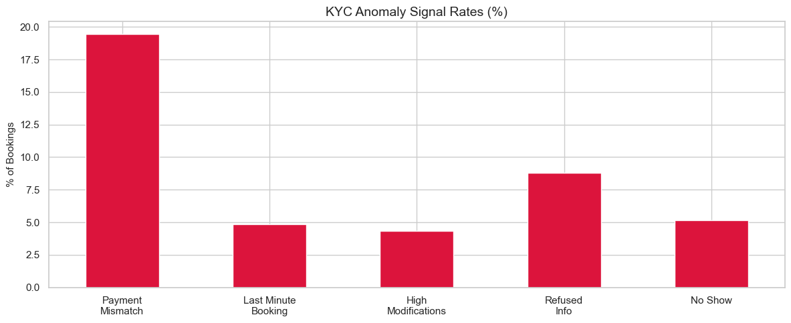
    


    
    KYC Signal Rates:
      flag_payment_mismatch: 19.4%
      flag_last_minute: 4.8%
      flag_high_modifications: 4.4%
      flag_refused_info: 8.8%
      flag_no_show: 5.2%
    

### Guests with multiple KYC flags


```python

df_kyc_full['total_flags'] = df_kyc_full[kyc_flags].sum(axis=1)

fig, ax = plt.subplots(figsize=(10, 5))
df_kyc_full['total_flags'].value_counts().sort_index().plot(
    kind='bar', ax=ax, color='crimson', edgecolor='white'
)
ax.set_title('Number of KYC Flags per Booking')
ax.set_xlabel('Number of Flags')
ax.set_ylabel('Count')
ax.tick_params(axis='x', rotation=0)
plt.tight_layout()
plt.savefig("..\Images\EDA\KYC_Anomalies\Guests_with_multiple.png")
plt.show()

high_risk = df_kyc_full[df_kyc_full['total_flags'] >= 3]
print(f'\nHigh Risk Bookings (3+ flags): {len(high_risk):,} ({len(high_risk)/len(df_kyc_full)*100:.1f}%)')
```


    
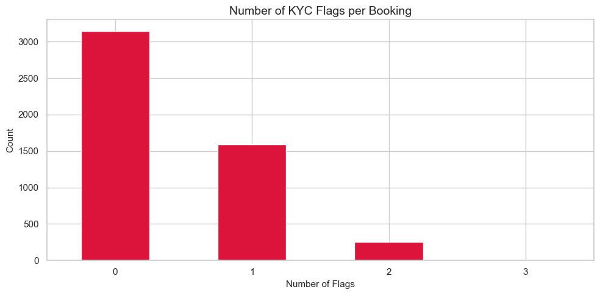
    


    
    High Risk Bookings (3+ flags): 13 (0.3%)
    

---

## CORRELATION ANALYSIS

### Correlation between spend columns and satisfaction


```python

corr_cols = ['spa_spend', 'restaurant_spend', 'bar_spend', 
             'excursion_spend', 'num_complaints', 
             'reception_visits', 'overall_satisfaction']

corr_matrix = df_stays_beha[corr_cols].corr()

fig, ax = plt.subplots(figsize=(10, 8))
sns.heatmap(corr_matrix, annot=True, fmt='.2f', cmap='coolwarm',
            ax=ax, linewidths=0.5, vmin=-1, vmax=1)
ax.set_title('Correlation Matrix — Stay Behavior')
plt.tight_layout()
plt.savefig("..\Images\EDA\Correlations\Spend_vs_satisfaction.png")
plt.show()
```


    
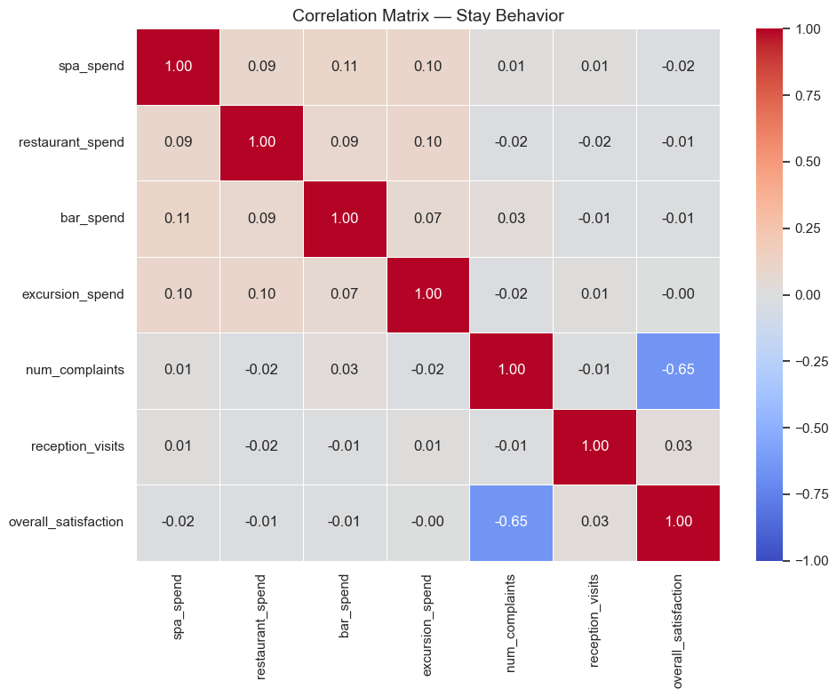
    


------

# EDA SUMMARY


```python
print('=' * 60)
print('EDA SUMMARY — GUEST INTELLIGENCE SYSTEM')
print('=' * 60)

print(f"""
DATASET OVERVIEW
─────────────────────────────────────────
Guests:               {len(df_guests):,}
Bookings:             {len(df_bookings):,}
Stays Behavior:       {len(df_stays_beha):,}
Reviews:              {len(df_reviews):,}
Complaints:           {len(df_complaints):,}
Activity Preferences: {len(df_act_preferences):,}
Activity Catalog:     {len(df_act_catalog):,}

KEY METRICS
─────────────────────────────────────────
Avg Booking Value:    €{df_bookings['total_booking_value'].mean():.2f}
Avg Length of Stay:   {df_bookings['length_of_stay'].mean():.1f} nights
Avg Satisfaction:     {df_stays_beha['overall_satisfaction'].mean():.1f}/10
Avg Review Rating:    {df_reviews['overall_experience'].mean():.1f}/5
Complaint Rate:       {(df_stays_beha['num_complaints'] > 0).mean()*100:.1f}%
Review Response Rate: {len(df_reviews)/len(df_stays_beha)*100:.1f}%
Cancellation Rate:    {(df_bookings['booking_status']=='Cancelled').mean()*100:.1f}%

KYC SIGNALS
─────────────────────────────────────────
Payment Mismatch:     {df_kyc_full['flag_payment_mismatch'].mean()*100:.1f}%
Last Minute Booking:  {df_kyc_full['flag_last_minute'].mean()*100:.1f}%
High Modifications:   {df_kyc_full['flag_high_modifications'].mean()*100:.1f}%
Refused Info:         {df_kyc_full['flag_refused_info'].mean()*100:.1f}%
High Risk (3+ flags): {len(high_risk)/len(df_kyc_full)*100:.1f}%
""")

conn.close()
print('EDA Complete!')
```

    ============================================================
    EDA SUMMARY — GUEST INTELLIGENCE SYSTEM
    ============================================================
    
    DATASET OVERVIEW
    ─────────────────────────────────────────
    Guests:               3,500
    Bookings:             5,000
    Stays Behavior:       3,021
    Reviews:              2,095
    Complaints:           1,698
    Activity Preferences: 3,021
    Activity Catalog:     81
    
    KEY METRICS
    ─────────────────────────────────────────
    Avg Booking Value:    €2082.86
    Avg Length of Stay:   5.3 nights
    Avg Satisfaction:     6.2/10
    Avg Review Rating:    3.9/5
    Complaint Rate:       34.7%
    Review Response Rate: 69.3%
    Cancellation Rate:    15.5%
    
    KYC SIGNALS
    ─────────────────────────────────────────
    Payment Mismatch:     19.4%
    Last Minute Booking:  4.8%
    High Modifications:   4.4%
    Refused Info:         8.8%
    High Risk (3+ flags): 0.3%
    
    EDA Complete!
    
