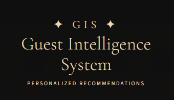

# Guest_Intelligence_System_Final_Project
Guest Intelligence System (GIS) — A hospitality recommender system  combining Content-Based Filtering and Collaborative Filtering (WBPR)  to deliver personalized activity recommendations with interactive Streamlit dashboard.  
Final Data Science and Machine Learning Project.

<p align="center">
  
  
  
  
  
  
  
  
  
  
  
  
</p>

<h1 align="center"> Guest Intelligence System (GIS)</h1>

<p align="center">
  
</p>

<p align="center">
  <em>A hospitality recommender system combining Content-Based Filtering and Collaborative Filtering (WBPR) to deliver personalized activity recommendations — Final Data Science & Machine Learning Project</em>
</p>

## 📑 Table of Contents

1. [Project Overview](#-project-overview)
2. [Goal](#-goal)
3. [Repository Structure](#-repository-structure)
4. [System Architecture](#system-architecture)
5. [Recommender System](#-recommender-system)
6. [Data Overview](#-data-overview)
7. [Application Layer](#-application-layer)
8. [Business Value](#-business-value)
9. [Repository Scope](#-repository-scope)
10. [Potential Extensions](#-potential-extensions)
11. [Authors](#-authors)
12. [License](#-license)


---

## 📌 Project Overview

The Guest Intelligence System (GIS) is an end-to-end data science project designed to simulate a real-world guest intelligence platform in the hospitality industry.

It leverages structured behavioral data — including bookings, stay activity, preferences, and feedback — to build rich guest profiles and generate personalized recommendations that enhance the overall guest experience.

The system integrates machine learning, recommender systems, and modern AI interfaces to bridge the gap between raw data and actionable insights.

---

## 🎯 Goal

- Develop a Hybrid Recommender System combining Content-Based and Collaborative Filtering
- Build behavioral guest profiles (KYC-style) using multi-source data
- Deliver personalized recommendations with explainability
- Provide business insights to support decision-making in hospitality environments

## 🗂 Repository Structure

```
GUEST_INTELLIGENCE_SYSTEM/
│
├── 2.EDA_files/              # EDA visualizations and supporting files
├── Chatboot_Video_u.../      # Demo video of the Streamlit application
├── 2.EDA.md                  # Exploratory Data Analysis report (Markdown)
├── Guest Intelligence ...    # Project documentation
├── LICENSE                   # MIT License
└── README.md                 # This file
```

> ⚠️ **Note:** This public repository contains only a curated subset of the project — EDA reports, visualizations, and a demo video. The full project (datasets, feature engineering, model notebooks, Streamlit app, and trained models) is available in a **private repository upon request**. See [Repository Policy](#-repository-policy) for details.

---

<a id="system-architecture"></a>
## ⚙️ System Architecture

The GIS follows a modular pipeline:

1. **Data Generation & Processing**
   Synthetic datasets simulate realistic guest behavior across multiple touchpoints

2. **Feature Engineering**
   Aggregation of behavioral, transactional, and preference-based signals

3. **Hybrid Recommendation Engine**

   * Content-Based Filtering (similarity-driven)
   * Collaborative Filtering (implicit feedback)
   * Adaptive combination based on interaction density

4. **AI-Powered Interface**
   Interactive Streamlit dashboard with recommendation outputs and guest insights

---

## 🤖 Recommender System

The recommendation engine combines:

* **Content-Based Filtering** to match guest preferences with activity attributes
* **Collaborative Filtering (WBPR)** to leverage implicit behavioral patterns
* **Adaptive Hybrid Strategy** to dynamically balance both approaches depending on available user data

The system is designed to handle **high sparsity environments** and deliver relevant recommendations even for low-interaction users.

---

## 📊 Data Overview

All data used in this project is **synthetically generated** to reflect realistic hospitality scenarios while ensuring privacy.

The datasets include:

* Guest profiles and demographics
* Booking and stay history
* Behavioral interactions and preferences
* Reviews and satisfaction metrics
* Activity catalog

---

## 💡 Application Layer

The system is delivered through an **interactive Streamlit dashboard**, enabling:

* Guest-level recommendation queries
* Personalized activity suggestions
* Interpretable scoring and recommendation rationale
* High-level business insights and visual analytics

---

## 🚀 Business Value

GIS demonstrates how data science and AI can:

* Enhance **guest personalization**
* Improve **customer experience and satisfaction**
* Support **data-driven decision making**
* Enable **scalable recommendation systems** in hospitality and similar domains

---

## 🔒 Repository Scope

This repository is a **public showcase** of the project and includes:

* Project overview and documentation
* Exploratory data analysis (EDA)
* Visualizations
* Demo materials

Some components (e.g., full pipelines, models, and application code) are not included and can be discussed upon request.

---

## 🔄 Potential Extensions

The system architecture can be adapted to multiple domains:

* Retail (product recommendation)
* Streaming platforms (content recommendation)
* Education (course recommendation)
* Healthcare (wellness program recommendation)

---

## 👤 Authors

**Janete Barbosa**
Data Science & Machine Learning

* LinkedIn: [https://linkedin.com/in/janete-barbosa](https://linkedin.com/in/janete-barbosa)
* GitHub: [https://github.com/janeteccbarbosa28-eng](https://github.com/janeteccbarbosa28-eng)

---

## 📄 License

MIT License

---
<p align="center">
  <em>Built with 💛 for the hospitality industry — GIS © 2026 Janete Barbosa</em>
</p>